# 一、异常

## （一）基本介绍

```java
public class Exception01 {
public static void main(String[] args) {
int num1 = 10;
int num2 = 0;//Scanner();
//老韩解读
//1. num1 / num2 => 10 / 0
//2. 当执行到 num1 / num2 因为 num2 = 0, 程序就会出现(抛出)异常 ArithmeticException
//3. 当抛出异常后，程序就退出，崩溃了 , 下面的代码就不在执行
//4. 大家想想这样的程序好吗? 不好，不应该出现了一个不算致命的问题，就导致整个系统崩溃
//5. java 设计者，提供了一个叫 异常处理机制来解决该问题
// int res = num1 / num2;
//如果程序员，认为一段代码可能出现异常/问题，可以使用 try-catch 异常处理机制来解决
//从而保证程序的健壮性
//将该代码块->选中->快捷键 ctrl + alt + t -> 选中 try-catch
//6. 如果进行异常处理，那么即使出现了异常，程序可以继续执行
try {
int res = num1 / num2;
} catch (Exception e) {
//e.printStackTrace();
System.out.println("出现异常的原因=" + e.getMessage());//输出异常信息
}
System.out.println("程序继续运行....");
}
}
```

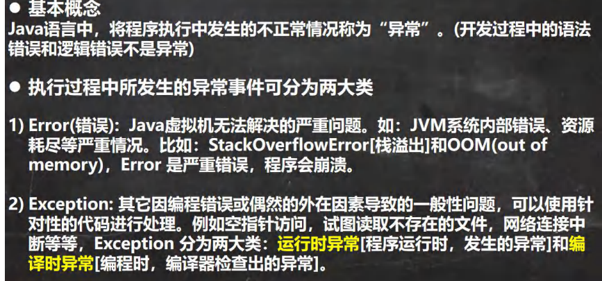

## （二）异常体系图

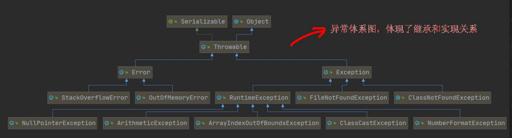


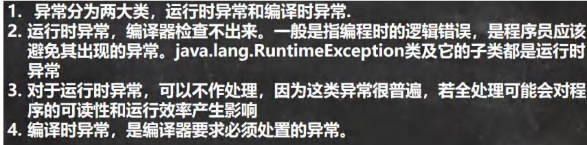

# 二、常见的运行时异常

## （一）基本介绍

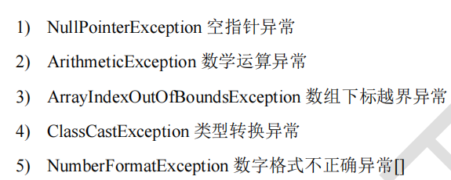

### 2、NullPointerException 空指针异常

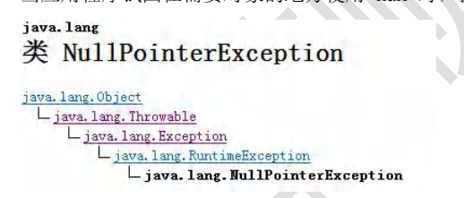

```java
public class NullPointerException_ {
public static void main(String[] args) {
String name = null;
System.out.println(name.length());
}
}
```


### 3、ArithmeticException 数学运算异常

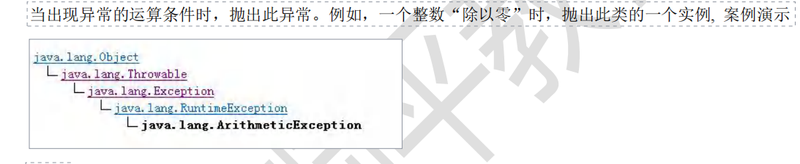

```java
public class ArrayIndexOutOfBoundsException_ {
public static void main(String[] args) {
int[] arr = {1,2,4};
for (int i = 0; i <= arr.length; i++) {
System.out.println(arr[i]);
}
}
}
```


### 4、ArrayIndexOutOfBoundsException 数组下标越界异常

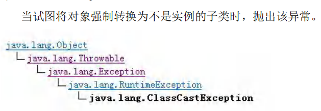


```java
public class ClassCastException_ {
public static void main(String[] args) {
A b = new B(); //向上转型
B b2 = (B)b;//向下转型，这里是 OK
C c2 = (C)b;//这里抛出 ClassCastException
}
}
class A {}
class B extends A {}
class C extends A {}
```


### 5、ClassCastException 类型转换异常

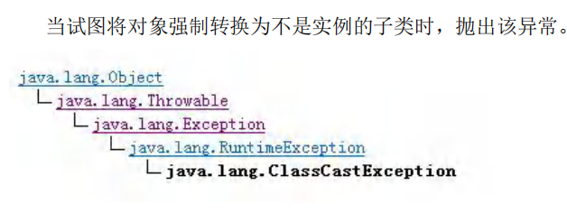

```java
public class ClassCastException_ {
public static void main(String[] args) {
A b = new B(); //向上转型
B b2 = (B)b;//向下转型，这里是 OK
C c2 = (C)b;//这里抛出 ClassCastException
}
}
class A {}
class B extends A {}
class C extends A {
```


### 6、NumberFormatException 数字格式不正确异常

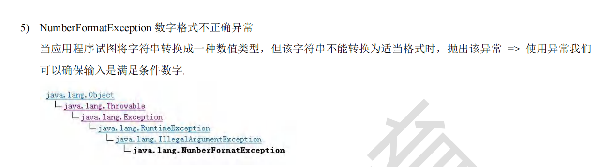

```java
public class NumberFormatException_ {
public static void main(String[] args) {
String name = "韩顺平教育";
//将 String 转成 int
int num = Integer.parseInt(name);//抛出 NumberFormatException
System.out.println(num);//1234
}
}
```

# 三、编译异常

## （一）基本介绍

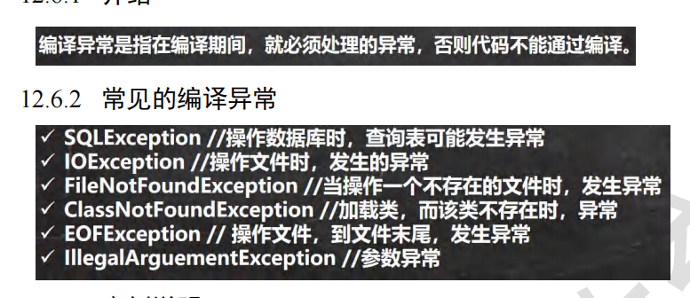

# 四、异常处理的方式

## （一）基本介绍

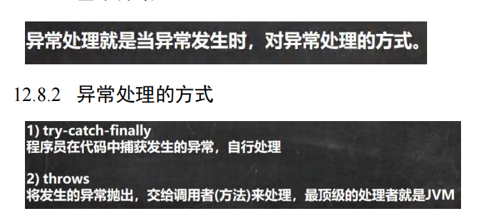

## （二）示意图

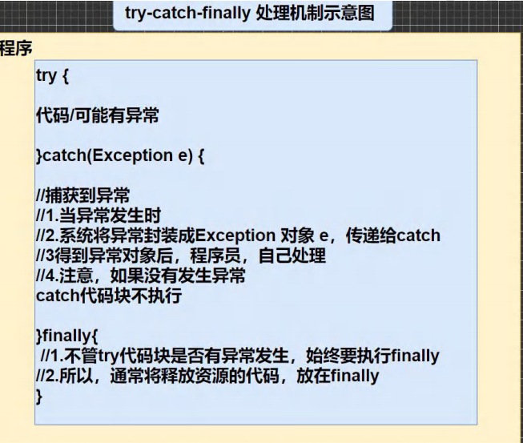


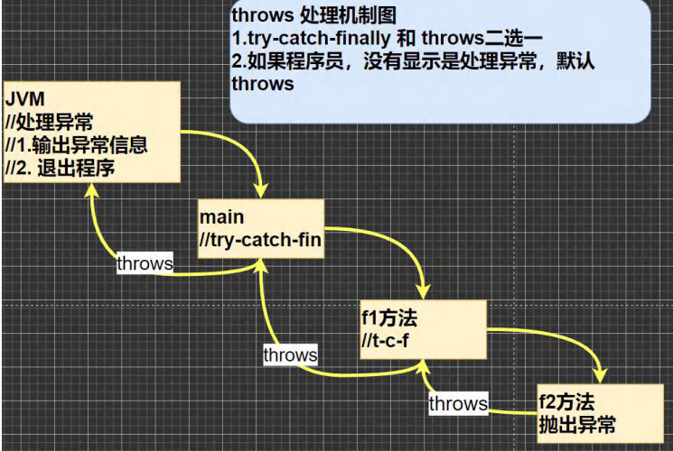

## （三）try-catch异常处理

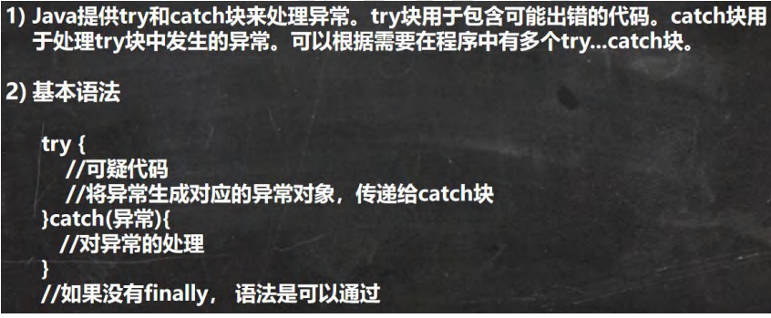

```java
public class TryCatchDetail {
public static void main(String[] args) {
//ctrl + atl + t
//老韩解读
//1. 如果异常发生了，则异常发生后面的代码不会执行，直接进入到 catch 块
//2. 如果异常没有发生，则顺序执行 try 的代码块，不会进入到 catch
//3. 如果希望不管是否发生异常，都执行某段代码(比如关闭连接，释放资源等)则使用如下代码- finally
try {
String str = "韩顺平";//下面的代码直接不执行。跳到catch中
int a = Integer.parseInt(str);
System.out.println("数字：" + a);
} catch (NumberFormatException e) {
System.out.println("异常信息=" + e.getMessage());
} finally {
System.out.println("finally 代码块被执行...");
}
System.out.println("程序继续...");
}
}
```


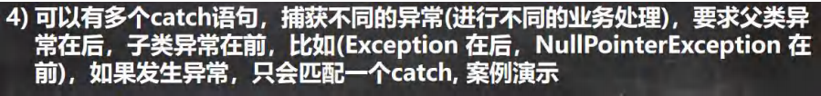

```java
public class TryCatchDetail02 {
public static void main(String[] args) {
//老韩解读
//1.如果 try 代码块有可能有多个异常
//2.可以使用多个 catch 分别捕获不同的异常，相应处理
//3.要求子类异常写在前面，父类异常写在后面
try {
Person person = new Person();
//person = null;
System.out.println(person.getName());//NullPointerException
int n1 = 10;
int n2 = 0;
int res = n1 / n2;//ArithmeticException
} catch (NullPointerException e) {
System.out.println("空指针异常=" + e.getMessage());

} catch (ArithmeticException e) {
System.out.println("算术异常=" + e.getMessage());
} catch (Exception e) {
System.out.println(e.getMessage());
} finally {
}
}
}
class Person {
private String name = "jack";
public String getName() {
return name;
}
}
```

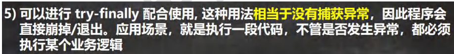

```java
public class TryCatchDetail03 {
public static void main(String[] args) {
/*
可以进行 try-finally 配合使用, 这种用法相当于没有捕获异常，
因此程序会直接崩掉/退出。应用场景，就是执行一段代码，不管是否发生异常，
都必须执行某个业务逻辑
*/
try{
int n1 = 10;
int n2 = 0;
System.out.println(n1 / n2);
}finally {
System.out.println("执行了 finally..");
}//从这直接退出程序
System.out.println("程序继续执行..");//不执行
}
}
```

tips：如果catch中有return或者throw，则先执行finally，否则按顺序从catch到finally顺序执行


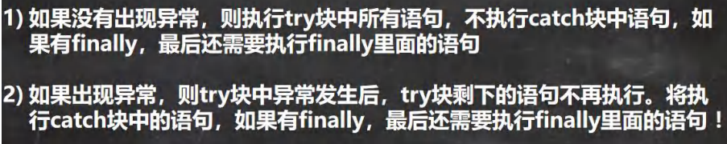

## （四）throws异常处理

### 1、基本介绍

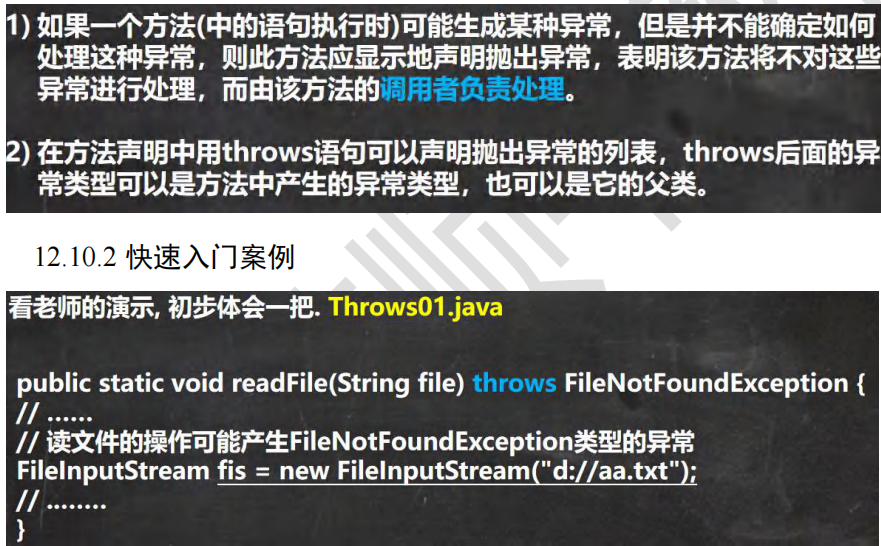

### 2、使用细节

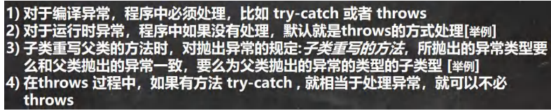

```java
public class ThrowsDetail {
public static void main(String[] args) {
f2();
}
public static void f2() /*throws ArithmeticException*/ {
//1.对于编译异常，程序中必须处理，比如 try-catch 或者 throws
//2.对于运行时异常，程序中如果没有处理，默认就是 throws 的方式处理
int n1 = 10;
int n2 = 0;
double res = n1 / n2;

}
public static void f1() throws FileNotFoundException {
//这里大家思考问题 调用 f3() 报错
//老韩解读
//1. 因为 f3() 方法抛出的是一个编译异常
//2. 即这时，就要 f1() 必须处理这个编译异常
//3. 在 f1() 中，要么 try-catch-finally ,或者继续 throws 这个编译异常
f3(); // 抛出异常
}
public static void f3() throws FileNotFoundException {
FileInputStream fis = new FileInputStream("d://aa.txt");
}
public static void f4() {
//老韩解读:
//1. 在 f4()中调用方法 f5() 是 OK
//2. 原因是 f5() 抛出的是运行异常
//3. 而 java 中，并不要求程序员显示处理,因为有默认处理机制
f5();
}
public static void f5() throws ArithmeticException {
}
}

class Father { //父类
public void method() throws RuntimeException {
}
}
class Son extends Father {//子类
//3. 子类重写父类的方法时，对抛出异常的规定:子类重写的方法，
// 所抛出的异常类型要么和父类抛出的异常一致，要么为父类抛出的异常类型的子类型
//4. 在 throws 过程中，如果有方法 try-catch , 就相当于处理异常，就可以不必 throws
@Override
public void method() throws ArithmeticException {
}
}
```

# 五、自定义异常

## （一）基本介绍

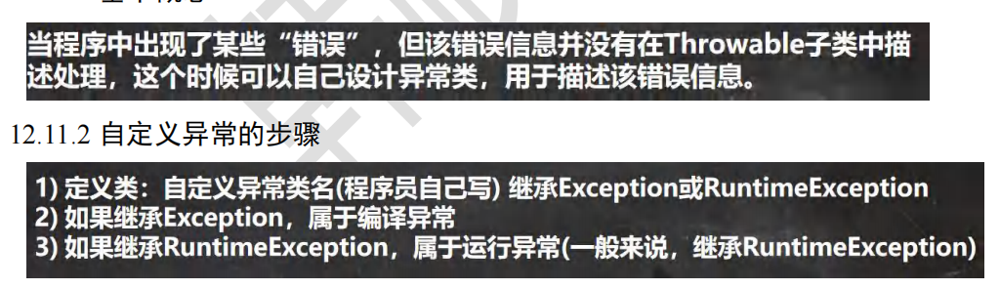

## （二）throw和throws的区别

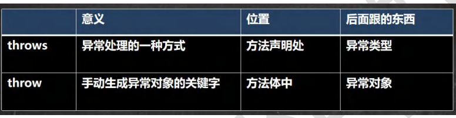

