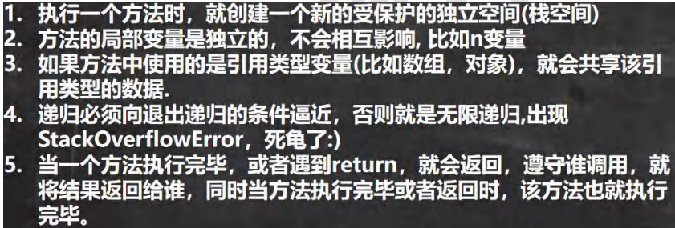
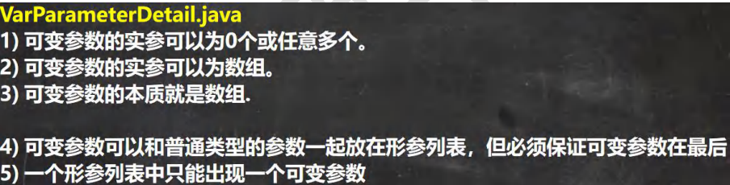
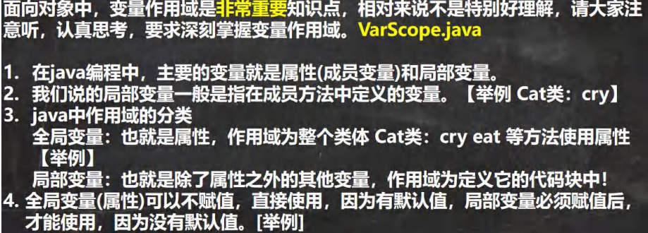

## 一、方法的使用入门

### (一)基本使用

```java
Person p1 = new Person();
//调用getSum方法，同时使得num1 = 10，num2 = 20
//把方法getSum返回的值先返回给调用此方法（getSum）的语句p1.getSum（10,20）赋给变量 resturnRes
int returnRes = p1.getSum(10,20);
System.out.println("getSum返回的值为" + returnRes);
class Person{
public int getSum(int num1,int num2){
int res = num1 + num2;
return res;
      }
}
```

1. public表示方法是公开的
2. int表示方法执行后，返回一个int值
3. getSum方法名
4. (int num1,int num2)形参列表，2个形参，可以接收用户传入的两个数
5. return res；表示把res的值返回(返回给谁呢？谁接收就返回给谁，如果要接收就得到这个值)
6. 在哪调用，就返回哪

### (二)成员方法注意事项


## 二、方法的传参机制

### (一)成员方法传参机制

基本数据类型，传递的是值(值拷贝)，形参的任何改变都不会影响实参！


### (二)引用数据类型的传参机制

引用类型传递的是地址(传递的也是值，但是值是地址)，可以通过形参影响实参

- tip：
- 类似p.age = 80看似是整型，实则age是为p的一个属性，所以指向的不是值而是地址
- 在调用方法时main方法会在原来的栈中开辟一个新的空间
- 基本数据类型实在栈中进行操作，而引用类型是指向堆中的一个空间，这个空间是地址，所以引用类型其实指向的是地址
- 在创建对象时会在堆中开辟一个空间

### (三)成员方法返回类型是引用类型


## 三、方法的递归调用

### (一)递归执行机制


tip：最顶层的方法执行完毕后返回到从上往下数的第二层(执行完毕后的方法所在的栈会被回收)，继续输出，以此类推，返回到主栈


### (二)递归的重要规则



## 四、方法重载

### (一)基本介绍

- java中允许同一个类中，多个同名方法的存在，丹要求形参列表不一致比如：System.out.println；out是PrintStream类型
- 重载的好处：减轻了起名的麻烦，减轻了记名的麻烦·

### (二)注意事项

1. 方法名：必须相同
2. 形参列表：必须不同(形参类型或者个数或者顺序，至少有一样不同，参数名无要求) 如int n1 和int a1就不能成功编译
3. 返回类型：无要求

## 五、可变参数

### (一)入门

- java中允许将同一个类中**多个同名同功能但参数个数不同**的方法，封装成一个方法。就可以通过可变参数实现
- 语法：访问修饰符 返回类型 方法名(数据类型...形参名){  }

```java
class A{
public int sum(int...nums){
    System.out.println("接收的参数的个数=" + num.length);//使用可变参数时，可以当做数组来使用，即num可以当做数组
    return 0;
  }
}
```

### (二)注意事项




## 六、作用域

### (一)基本使用



```java

class cat{
    int age = 10;//全局变量，也就是属性、作用域为整个类体cat类，cry、eat等方法使用属性
public void cry(){//n和name就是局部变量，n和name的作用域在cry方法中
    int n = 10;
    Stirng name = "jack";
 }
}
```

### (二)注意事项


- 属性生命周期较长，伴随着对象的创建而创建，伴随着对象的销毁而销毁。
- 局部变量，生命周期较短，伴随着它的代码块的执行而创建，伴随着代码块的结束而销毁。即在一次方法调用过程中


## 七、构造器

### (一)基本使用

- 我们来看一个需求：前面我们在创建人类的对象时，是先把一个对象创建好后，再给他的年龄和姓名属性赋值，如

果现在我要求，在创建人类的对象时，就直接指定这个对象的年龄和姓名，该怎么做? 这时就可以使用构造器。

- 语法：

  [修饰符] 方法名(形参列表){

  方法体;

  }

- 构造方法又叫构造器(constructor)，是类的一种特殊的方法，它的主要作用是完成对**新对象的初始化**。它有几个特点：

  \1) 方法名和类名相同

  \2) 没有返回值

  \3) 在创建对象时，系统会自动的调用该类的构造器完成对象的初始化。

### (二)注意事项


### (三)对象创建的流程分析


- int age = 90是比构造器先执行的，所以int流程先从0→90→20


- p对象实际上是p引用指向的对象(地址)，将来这个对象可能会被别的引用(如图中的p1p2)

## 八、this关键字

### (一)基本使用


- this指的是当前对象，哪个对象调用，this就代表哪个对象，this.xxx就是指当前对象的属性


- this可以当做堆中的属性

### (二)注意事项

- this关键字可以用来访问本类的属性、方法、构造器
- this用于区分当前类的属性和局部变量
- 访问成员方法的语法：this.方法名(参数列表);
- 访问构造器语法：this(参数列表)：会调用本类的无参构造器。注意**只能在构造器中**使用，而且this（参数列表）必须是构造器中的第一个语句
- this不能再类定义的外部使用，只能在类定义的方法中使用


