# 一、泛型

## （一）基本介绍

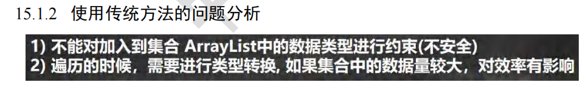

```java
public class Generic02 {
public static void main(String[] args) {
//使用传统的方法来解决===> 使用泛型
//老韩解读
//1. 当我们 ArrayList<Dog> 表示存放到 ArrayList 集合中的元素是 Dog 类型 (细节后面说...)
//2. 如果编译器发现添加的类型，不满足要求，就会报错
//3. 在遍历的时候，可以直接取出 Dog 类型而不是 Object
//4. public class ArrayList<E> {} E 称为泛型,那么 Dog->E
ArrayList<Dog> arrayList = new ArrayList<Dog>();
arrayList.add(new Dog("旺财", 10));
arrayList.add(new Dog("发财", 1));
arrayList.add(new Dog("小黄", 5));
//假如我们的程序员，不小心，添加了一只猫础
//arrayList.add(new Cat("招财猫", 8));
System.out.println("===使用泛型====");
for (Dog dog : arrayList) {
System.out.println(dog.getName() + "-" + dog.getAge());
}
}
}
/*
1.请编写程序，在 ArrayList 中，添加 3 个 Dog 对象
2.Dog 对象含有 name 和 age, 并输出 name 和 age (要求使用 getXxx())
3.老师使用泛型来完成代码
*/
class Dog {
private String name;
private int age;
public Dog(String name, int age) {
this.name = name;
this.age = age;
}
public String getName() {
return name;
}
public void setName(String name) {
this.name = name;
}
public int getAge() {
return age;
}
public void setAge(int age) {
this.age = age;
}
}
class Cat { //Cat 类
private String name;
private int age;
public Cat(String name, int age) {
this.name = name;
this.age = age;
}
public String getName() {
return name;
}
public void setName(String name) {
this.name = name;
}
public int getAge() {
return age;
}
public void setAge(int age) {
this.age = age;
}
}
```

## （二）泛型的好处与作用

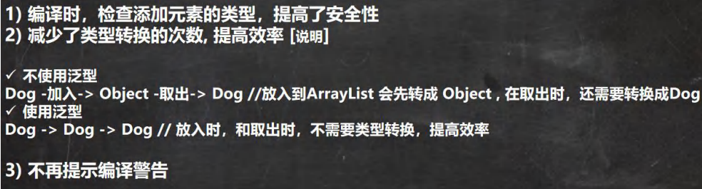


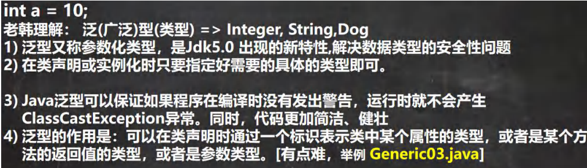

- 例如int a 它可以等于1、2、3，而泛型类似，E可以给它赋一个Integer或者String，可以表示一种数据类型的数据类型，由程序员指定，可以自定义如Dog

```java
public class Generic03 {
public static void main(String[] args) {
//注意，特别强调： E 具体的数据类型在定义 Person 对象的时候指定,即在编译期间，就确定 E 是什么类型
Person<String> person = new Person<String>("韩顺平教育");
person.show(); //String

你可以这样理解，上面的 Person 类
class Person {
String s ;//E 表示 s 的数据类型, 该数据类型在定义 Person 对象的时候指定,即在编译期间，就确定 E
是什么类型
public Person(String s) {//E 也可以是参数类型
this.s = s;
}
public String f() {//返回类型使用 E
return s;
}
}
*/
Person<Integer> person2 = new Person<Integer>(100);
person2.show();//Integer
/*
class Person {
Integer s ;//E 表示 s 的数据类型, 该数据类型在定义 Person 对象的时候指定,即在编译期间，就确定 E
是什么类型
public Person(Integer s) {//E 也可以是参数类型
this.s = s;
}
public Integer f() {//返回类型使用 E
return s;
}
}
*/
}
}
//泛型的作用是：可以在类声明时通过一个标识表示类中某个属性的类型，
// 或者是某个方法的返回值的类型，或者是参数类型
class Person<E> {
E s ;//E 表示 s 的数据类型, 该数据类型在定义 Person 对象的时候指定,即在编译期间，就确定 E 是什么类型
public Person(E s) {//E 也可以是参数类型
this.s = s;
}
public E f() {//返回类型使用 E
return s;
}
public void show() {
System.out.println(s.getClass());//显示 s 的运行类型
}
}
```

## （三）泛型的语法

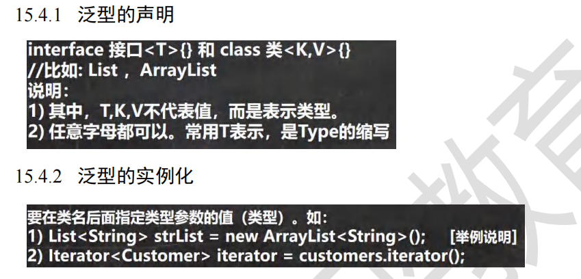

## （四）泛型的使用举例

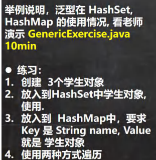

```java
public class GenericExercise {
public static void main(String[] args) {
//使用泛型方式给 HashSet 放入 3 个学生对象
HashSet<Student> students = new HashSet<Student>();
students.add(new Student("jack", 18));
students.add(new Student("tom", 28));
students.add(new Student("mary", 19));
//遍历
for (Student student : students) {
System.out.println(student);
}
//使用泛型方式给 HashMap 放入 3 个学生对象
//K -> String V->Student
HashMap<String, Student> hm = new HashMap<String, Student>();
/*
public class HashMap<K,V> {}
*/
hm.put("milan", new Student("milan", 38));
hm.put("smith", new Student("smith", 48));
第 712页
韩顺平循序渐进学 Java 零基础
hm.put("hsp", new Student("hsp", 28));
//迭代器 EntrySet
/*
public Set<Map.Entry<K,V>> entrySet() {
Set<Map.Entry<K,V>> es;
return (es = entrySet) == null ? (entrySet = new EntrySet()) : es;
}
*/
Set<Map.Entry<String, Student>> entries = hm.entrySet();
/*
public final Iterator<Map.Entry<K,V>> iterator() {
return new EntryIterator();
}
*/
Iterator<Map.Entry<String, Student>> iterator = entries.iterator();
System.out.println("==============================");
while (iterator.hasNext()) {
Map.Entry<String, Student> next = iterator.next();
System.out.println(next.getKey() + "-" + next.getValue());
}
}
}
/**
* 创建 3 个学生对象
* 放入到 HashSet 中学生对象, 使用. * 放入到 HashMap 中，要求 Key 是 String name, Value 就是 学生对象
* 使用两种方式遍历
*/
class Student {
private String name;
private int age;
public Student(String name, int age) {
this.name = name;
this.age = age;
}
public String getName() {
return name;
}
public void setName(String name) {
this.name = name;
}
public int getAge() {
return age;
}
public void setAge(int age) {
this.age = age;
}
@Override
public String toString() {
return "Student{" +
"name='" + name + '\'' +
", age=" + age +
'}';
}
}
```

## （五）泛型的注意事项和使用细节

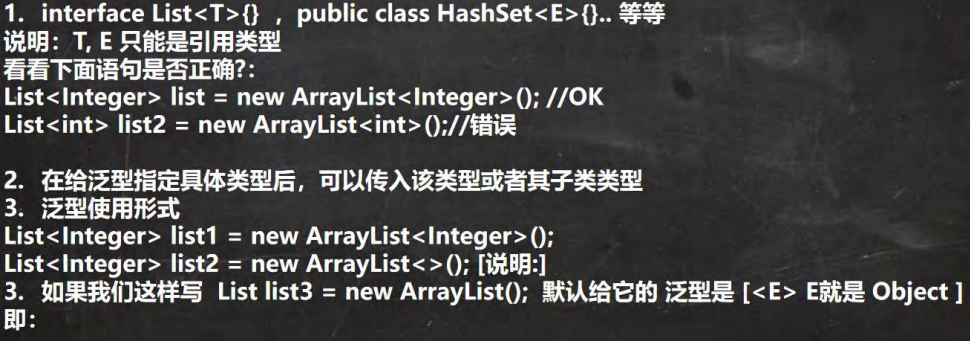

```java
public class GenericDetail {
public static void main(String[] args) {
//1.给泛型指向数据类型是，要求是引用类型，不能是基本数据类型
List<Integer> list = new ArrayList<Integer>(); //OK
//List<int> list2 = new ArrayList<int>();//错误
//2. 说明
//因为 E 指定了 A 类型, 构造器传入了 new A()
//在给泛型指定具体类型后，可以传入该类型或者其子类类型
Pig<A> aPig = new Pig<A>(new A());
aPig.f();
Pig<A> aPig2 = new Pig<A>(new B());
aPig2.f();
//3. 泛型的使用形式
ArrayList<Integer> list1 = new ArrayList<Integer>();
List<Integer> list2 = new ArrayList<Integer>();
//在实际开发中，我们往往简写
//编译器会进行类型推断, 老师推荐使用下面写法
ArrayList<Integer> list3 = new ArrayList<>();
List<Integer> list4 = new ArrayList<>();
ArrayList<Pig> pigs = new ArrayList<>();
//4. 如果是这样写 泛型默认是 Object
ArrayList arrayList = new ArrayList();//等价 ArrayList<Object> arrayList = new ArrayList<Object>();
/*
public boolean add(Object e) {
ensureCapacityInternal(size + 1); // Increments modCount!!
elementData[size++] = e;
return true;
}
*/
Tiger tiger = new Tiger();
/*
class Tiger {//类
Object e;
public Tiger() {}
public Tiger(Object e) {
this.e = e;
}
}
*/
}
}
class Tiger<E> {//类
E e;
public Tiger() {}
public Tiger(E e) {
this.e = e;
}
}
class A {}
class B extends A {}
class Pig<E> {//
E e;
public Pig(E e) {
this.e = e;
}
public void f() {
System.out.println(e.getClass()); //运行类型
}
}
```

# 二、自定义泛型

## （一）基本介绍

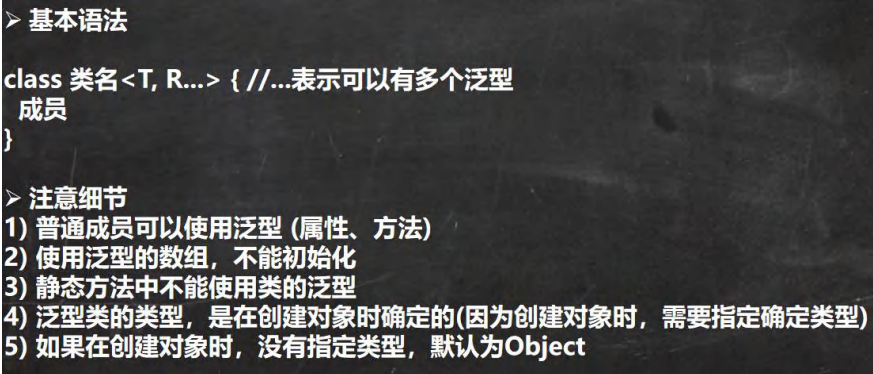

## （二）应用举例

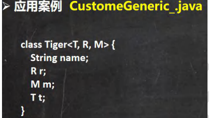

```java
public class CustomGeneric_ {
public static void main(String[] args) {
//T=Double, R=String, M=Integer
Tiger<Double,String,Integer> g = new Tiger<>("john");
g.setT(10.9); //OK
//g.setT("yy"); //错误，类型不对
System.out.println(g);
Tiger g2 = new Tiger("john~~");//OK T=Object R=Object M=Object
g2.setT("yy"); //OK ,因为 T=Object "yy"=String 是 Object 子类
System.out.println("g2=" + g2);
}
}
//老韩解读
//1. Tiger 后面泛型，所以我们把 Tiger 就称为自定义泛型类
//2, T, R, M 泛型的标识符, 一般是单个大写字母
//3. 泛型标识符可以有多个. //4. 普通成员可以使用泛型 (属性、方法)
//5. 使用泛型的数组，不能初始化 T[]ts = new T[];是
//6. 静态方法中不能使用类的泛型
class Tiger<T, R, M> {
String name;
R r; //属性使用到泛型
M m;
T t;
//因为数组在 new 不能确定 T 的类型，就无法在内存开空间
T[] ts;
public Tiger(String name) {
this.name = name;
}
public Tiger(R r, M m, T t) {//构造器使用泛型
this.r = r;
this.m = m;
this.t = t;
}
public Tiger(String name, R r, M m, T t) {//构造器使用泛型
this.name = name;
this.r = r;
this.m = m;
this.t = t;
}
//因为静态是和类相关的，在类加载时，对象还没有创建
//所以，如果静态方法和静态属性使用了泛型，JVM 就无法完成初始化
// static R r2;
// public static void m1(M m) {
//
// }
//方法使用泛型
public String getName() {
return name;
}
public void setName(String name) {
this.name = name;
}
public R getR() {
return r;
}
public void setR(R r) {//方法使用到泛型
this.r = r;
}
public M getM() {//返回类型可以使用泛型. return m;
}
public void setM(M m) {
this.m = m;
}
public T getT() {
return t;
}
public void setT(T t) {
this.t = t;
}
@Override
public String toString() {
return "Tiger{" +
"name='" + name + '\'' +
", r=" + r +
", m=" + m +
", t=" + t +
", ts=" + Arrays.toString(ts) +
'}';
}
}
```

## （三）自定义泛型接口

###   1、基本介绍

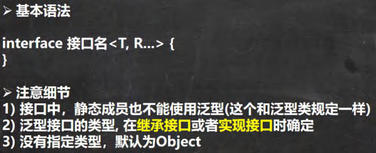

### 2、举例说明

```java
public class CustomInterfaceGeneric {
public static void main(String[] args) {
}
}
/**
* 泛型接口使用的说明
* 1. 接口中，静态成员也不能使用泛型
* 2. 泛型接口的类型, 在继承接口或者实现接口时确定
* 3. 没有指定类型，默认为 Object
*/
//在继承接口 指定泛型接口的类型
interface IA extends IUsb<String, Double> {
}
//当我们去实现 IA 接口时，因为 IA 在继承 IUsu 接口时，指定了 U 为 String R 为 Double
//，在实现 IUsu 接口的方法时，使用 String 替换 U, 是 Double 替换 R
class AA implements IA {
@Override
public Double get(String s) {
return null;
}
@Override
public void hi(Double aDouble) {
}
@Override
public void run(Double r1, Double r2, String u1, String u2) {
}
}
//实现接口时，直接指定泛型接口的类型
//给 U 指定 Integer 给 R 指定了 Float
//所以，当我们实现 IUsb 方法时，会使用 Integer 替换 U, 使用 Float 替换 R
class BB implements IUsb<Integer, Float> {
@Override
public Float get(Integer integer) {
return null;
}
@Override
public void hi(Float aFloat) {
}
@Override
public void run(Float r1, Float r2, Integer u1, Integer u2) {
}
}
//没有指定类型，默认为 Object
//建议直接写成 IUsb<Object,Object>
class CC implements IUsb { //等价 class CC implements IUsb<Object,Object> {
@Override
public Object get(Object o) {
return null;
}
@Override
public void hi(Object o) {
}
@Override
public void run(Object r1, Object r2, Object u1, Object u2) {
}
}
interface IUsb<U, R> {
int n = 10;
//U name; 不能这样使用
//普通方法中，可以使用接口泛型
R get(U u);
void hi(R r);
void run(R r1, R r2, U u1, U u2);
//在 jdk8 中，可以在接口中，使用默认方法, 也是可以使用泛型
default R method(U u) {
return null;
}
}
```

## （四）自定义泛型方法

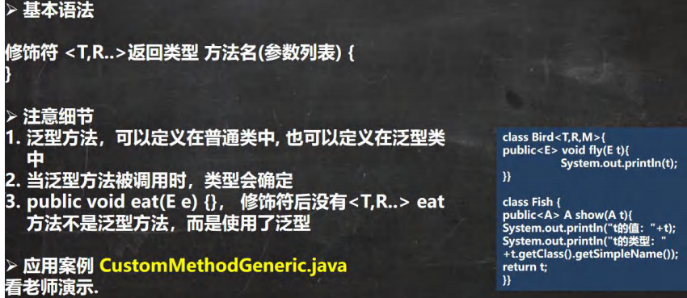

```java
@SuppressWarnings({"all"})
public class CustomMethodGeneric {
public static void main(String[] args) {
Car car = new Car();
car.fly("宝马", 100);//当调用方法时，传入参数，编译器，就会确定类型
System.out.println("=======");
car.fly(300, 100.1);//当调用方法时，传入参数，编译器，就会确定类型
//测试
//T->String, R-> ArrayList
Fish<String, ArrayList> fish = new Fish<>();
fish.hello(new ArrayList(), 11.3f);
}
}
//泛型方法，可以定义在普通类中, 也可以定义在泛型类中
class Car {//普通类
public void run() {//普通方法
}
//说明 泛型方法
//1. <T,R> 就是泛型
//2. 是提供给 fly 使用的
public <T, R> void fly(T t, R r) {//泛型方法
System.out.println(t.getClass());//String
System.out.println(r.getClass());//Integer
}
}
class Fish<T, R> {//泛型类
public void run() {//普通方法
}
public<U,M> void eat(U u, M m) {//泛型方法
}
//说明
//1. 下面 hi 方法不是泛型方法
//2. 是 hi 方法使用了类声明的 泛型
public void hi(T t) {
}
//泛型方法，可以使用类声明的泛型，也可以使用自己声明泛型
public<K> void hello(R r, K k) {
System.out.println(r.getClass());//ArrayList
System.out.println(k.getClass());//Float
}
}
```

## 三、 泛型的继承和通配符

## （一）基本说明

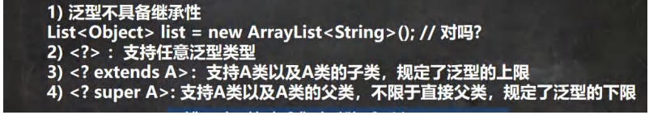

## （二）应用案例

```java
public class GenericExtends {
public static void main(String[] args) {
Object o = new String("xx");
//泛型没有继承性
//List<Object> list = new ArrayList<String>();错误
//举例说明下面三个方法的使用
List<Object> list1 = new ArrayList<>();
List<String> list2 = new ArrayList<>();
List<AA> list3 = new ArrayList<>();
List<BB> list4 = new ArrayList<>();
List<CC> list5 = new ArrayList<>();
//如果是 List<?> c ，可以接受任意的泛型类型
printCollection1(list1);
printCollection1(list2);
printCollection1(list3);
printCollection1(list4);
printCollection1(list5);
//List<? extends AA> c： 表示 上限，可以接受 AA 或者 AA 子类
// printCollection2(list1);//×
// printCollection2(list2);//×
printCollection2(list3);//√
printCollection2(list4);//√
printCollection2(list5);//√
//List<? super AA> c: 支持 AA 类以及 AA 类的父类，不限于直接父类
printCollection3(list1);//√
//printCollection3(list2);//×
printCollection3(list3);//√
//printCollection3(list4);//×
//printCollection3(list5);//×
//冒泡排序
//插入排序
//....
}
// ? extends AA 表示 上限，可以接受 AA 或者 AA 子类
public static void printCollection2(List<? extends AA> c) {
for (Object object : c) {
System.out.println(object);
}
}
//说明: List<?> 表示 任意的泛型类型都可以接受
public static void printCollection1(List<?> c) {
for (Object object : c) { // 通配符，取出时，就是 Object
System.out.println(object);
}
}
// ? super 子类类名 AA:支持 AA 类以及 AA 类的父类，不限于直接父类，
//规定了泛型的下限
public static void printCollection3(List<? super AA> c) {
for (Object object : c) {
System.out.println(object);
}
}
}
class AA {
}
class BB extends AA {
}
class CC extends BB {
}
```

