# 一、封装

## （一）基本介绍


eg：电视机的操作就是典型封装，电视机上有很多按钮，遥控器也有很多按钮。其中遥控器有一个开关，当按下开关时，电视机打开；还有一个音量按钮，往上按提升音量，往下降低音量。开机原本是非常复杂的过程，但是普通用户不需要了解电视机内部的工作原理，只需要通过遥控器就可以进行开机和关机的操作，音量也是类似的。

## （二）封装的好处

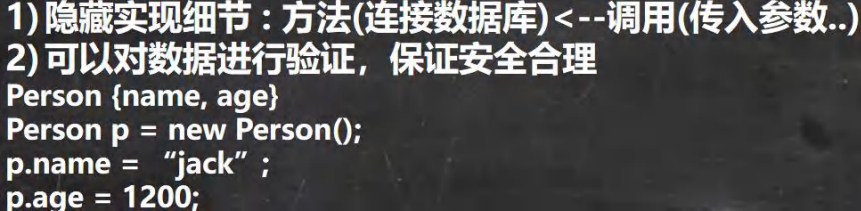

## （三）封装的步骤

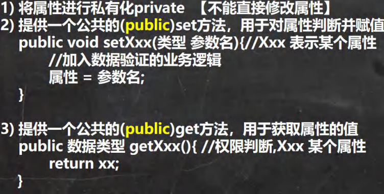

# 二、继承

## （一）基本介绍

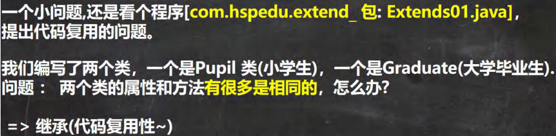

## （二）继承的示意图

​        继承可以解决代码复用,让我们的编程更加靠近人类思维.当多个类存在相同的属性(变量)和方法时,可以从这些类中

抽象出父类,在父类中定义这些相同的属性和方法，所有的子类不需要重新定义这些属性和方法，只需要通过 extends 来

声明继承父类即可。

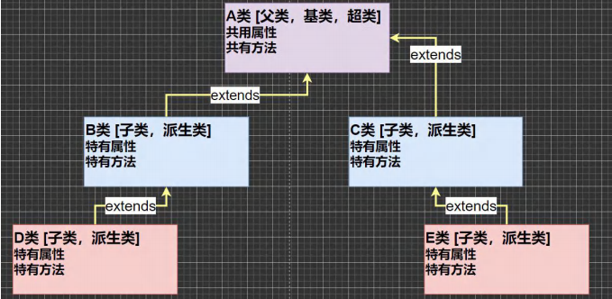

## （三）继承的基本语法

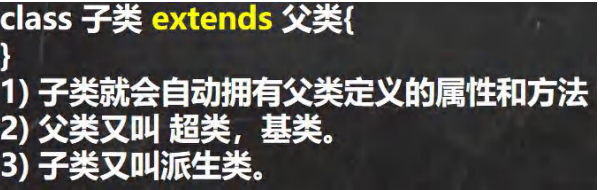


## （四）继承带来的便利与讨论

### 1、便利

1.  代码的复用性提高了
2. 代码的扩展性和维护性提高了（当父类拓展时，所有的子类都会有影响）

### 2、讨论与细节

1. 子类继承了所有的属性和方法，**非私有**的属性和方法可以在子类**直接访问**, 但是**私有**属性和方法**不能**在子类直接访

   问，要通过**父类提供**公共的方法去访问

2. 子类必须调用父类的构造器， 完成父类的初始化

3. 当创建子类对象时，不管使用子类的哪个构造器，默认情况下总会去调用父类的无参构造器，如果父类没有提供无

   参构造器（如用了有参构造器导致原先的默认构造器被覆盖），则必须在子类的构造器中用 super（）去指定使用父类的哪

   个构造器完成对父类的初始化工作，否则，编译不会通过

4) 如果希望指定去调用父类的某个构造器，则显式的调用一下 : super(参数列表)，利用实参相应的字符类型与父类的

   形参列表相对应即可,

5) super 在使用时，必须放在构造器第一行(super（） 只能在构造器中使用，而super可以随便)

6) super() 和 this() 都只能放在构造器第一行，因此这两个方法不能共存在一个构造器

7) java 所有类都是 Object 类的子类, Object 是所有类的基类. （ctrl + H 可以查看继承的关系）

8) 父类构造器的调用不限于直接父类！将一直往上追溯直到 Object 类(顶级父类)

9) 子类最多只能继承一个父类(指直接继承)，即 java 中是**单继承机制**。

思考：如何让 A 类继承 B 类和 C 类？ 【A 先继承 B， B 再继承 C】

10) 不能滥用继承，子类和父类之间必须满足 is-a 的逻辑关系（Cat extend Animal）

## （五）继承的本质分析

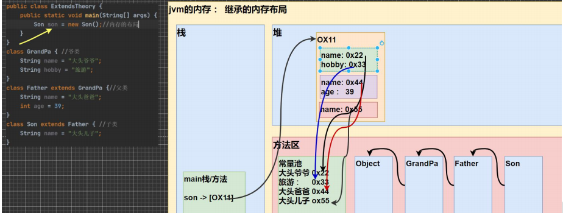

- 在创建子类的过程中，首先加载的使我们的类（Object 、Grandpa 、Father 、Son），然后看继承关系，从对顶级的父类开始加载
- 虽然0x11中有许多类的属性，但是都称作son对象，最后返回给主方法的对象引用
- 当用son访问不同的属性时，访问的规则是要按照查找规则来安排顺序，首先要看子类是否有该属性
- 如果子类有这个属性并且可以访问（如果不可以访问则报错，如private），则返回信息
- 如果子类没有这个属性，就看父类有没有这个属性，如果父类有该属性，并且可以访问，则返回信息
- 如果父类没有则再访问再上一级父类，直到Object

# 三、super关键字

## （一）基本介绍

super 代表父类的引用，用于访问父类的属性、方法、构造器

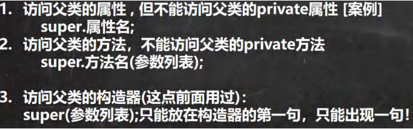

- 图中的第二点为直接查找父类，跳过本类

## （二）使用细节

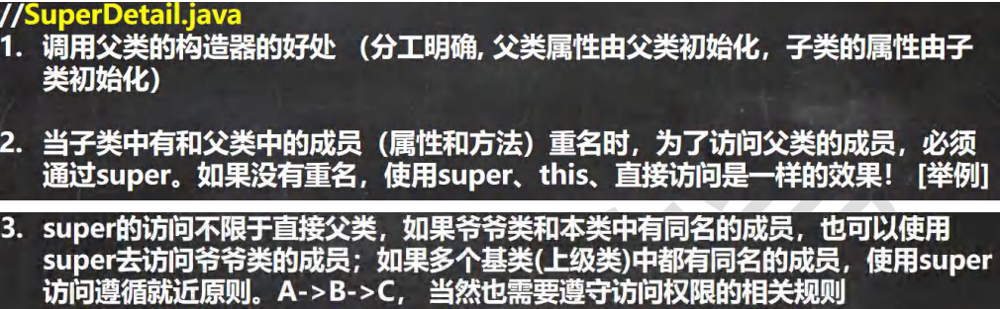

- super.方法名.（参数列表）直接查找父类，跳过本类，this和直接访问遵循就近原则

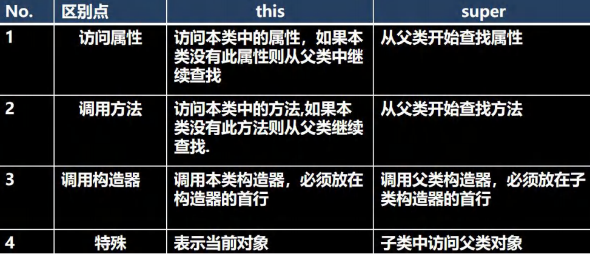

# 四、方法重写 / 覆盖（override）

## （一）基本介绍


## （二）细节

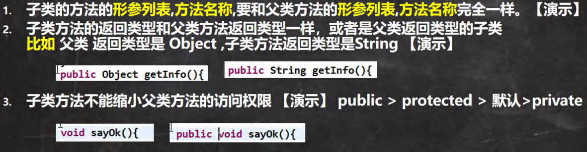

tips：

- 多态是函数名一样但是函数签名不一样
- 覆盖是函数签名一样
- 函数签名 = 函数名 + 函数形参列表

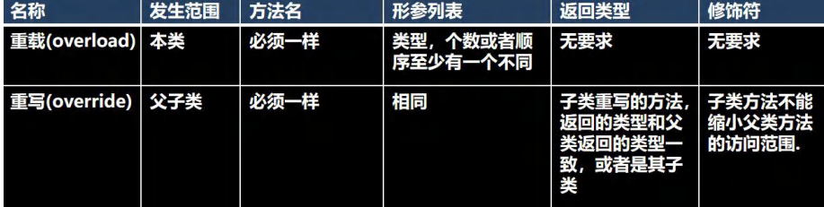

# 五、多态

## （一）基本介绍

- 方法或对象具有多种形态。是面向对象的第三大特征，多态是建立在封装和继承基础之上的

```java
public class PloyMethod {
public static void main(String[] args) {
//方法重载体现多态
A a = new A();
//这里我们传入不同的参数，就会调用不同 sum 方法，就体现多态
System.out.println(a.sum(10, 20));
System.out.println(a.sum(10, 20, 30))
    //方法重写体现多态
B b = new B();
a.say();
b.say();
    }
}
class B { //父类
public void say() {
System.out.println("B say() 方法被调用...");
      }
          }
class A extends B {//子类
public int sum(int n1, int n2){//和下面 sum 构成重载
return n1 + n2;
       }
public int sum(int n1, int n2, int n3){
return n1 + n2 + n3;
     }
public void say() {
System.out.println("A say() 方法被调用...");
  }
}
```

## （二）入门

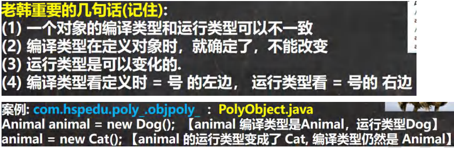

- 图中Dog对象是Animal的子类，父类的一个引用可以指向子类的一个对象，因为animal准确来讲是对象的引用，而后面new Dog（）是真正的对象
- Animal animal = new Animal();这个是编译类型和运行类型都一样
- 看左边的时候如果调用父类方法必须要被子类重写，因为运行时要看子类，不重写会报错
- 属性看编译，方法看运行

## （三）向上转型

 多态的**前提是**：两个对象(类)存在继承关系

 多态的向上转型

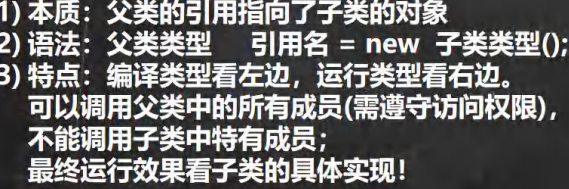

- 本质解读：把子类升级到父类了，向上转了，父类在上面，子类在下面，有点类似于把子类往上提
- 在编译阶段，能调用哪些成员，是由编译类型来决定的
- 最终运行效果看子类（运行类型）的具体表现，即调用方法时，按照从子类开始查找方法，然后调用
- 编译时和运行时的对象不一样，编译时会从顶级类型开始向父类查找，运行时云从运行类型开始向父类查找

## （四）向下转型

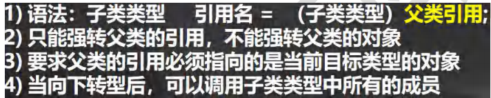

## （五）属性重写问题

- 属性没有重写之说！属性的值看编译类型
- instanceOf 比较操作符，用于判断对象的**运行类型**是否为 XX 类型或 XX 类型的子类型

## （六）动态绑定机制

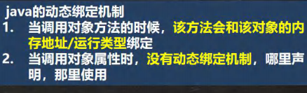

## （七）多态的应用

### 1、多态数组

- 数组的定义类型为父类类型，里面保存的实际元素类型为子类类型

### 2、多态参数


# 六、Object类

## （一）基本介绍

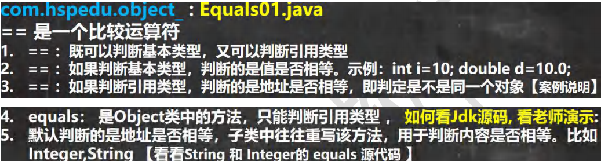

## （二）java 子类重写equals

```java
package com.hspedu.object_;
public class EqualsExercise01 {
public static void main(String[] args) {
Person person1 = new Person("jack", 10, '男');
Person person2 = new Person("jack", 20, '男');
System.out.println(person1.equals(person2));//假
}
}
//判断两个 Person 对象的内容是否相等，
//如果两个 Person 对象的各个属性值都一样，则返回 true，反之 false
class Person{ //extends Object
private String name;
private int age;
private char gender;
//重写 Object 的 equals 方法
public boolean equals(Object obj) {
//判断如果比较的两个对象是同一个对象，则直接返回 true
if(this == obj) {
return true;
}
//类型判断
if(obj instanceof Person) {//是 Person，我们才比较
//进行 向下转型, 因为我需要得到 obj 的 各个属性
Person p = (Person)obj;
return this.name.equals(p.name) && this.age == p.age && this.gender == p.gender;
}
//如果不是 Person ，则直接返回 false
return false;
}
public Person(String name, int age, char gender) {
this.name = name;
this.age = age;
this.gender = gender;
}
public String getName() {
return name;
}
public void setName(String name) {
this.name = name;
}
public int getAge() {
return age;
}
public void setAge(int age) {
this.age = age;
}
public char getGender() {
return gender;
}
public void setGender(char gender) {
this.gender = gender;
    }
}

```

## （三）hashCode

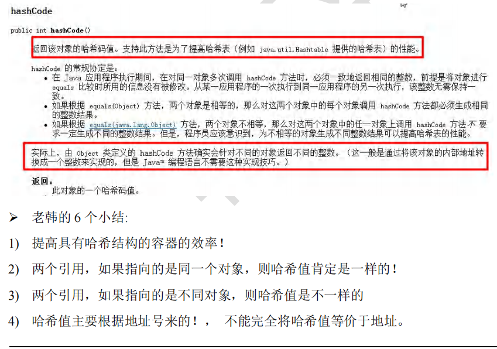

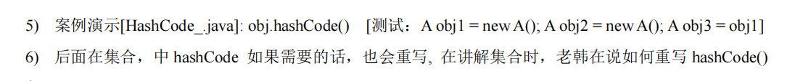

## （四）toString

1) 基本介绍

​      默认返回：全类名+@+哈希值的十六进制，【查看 Object 的 toString 方法】（全类名：包名 + 类名，完整的类名）

​      子类往往重写 toString 方法，用于返回对象的属性信息

2) 重写 toString 方法，打印对象或拼接对象时，都会自动调用该对象的 toString 形式

```java
package com.hspedu.object_;
public class ToString_ {
public static void main(String[] args) {
/*
Object 的 toString() 源码
(1)getClass().getName() 类的全类名(包名+类名 )
(2)Integer.toHexString(hashCode()) 将对象的 hashCode 值转成 16 进制字符串
public String toString() {
return getClass().getName() + "@" + Integer.toHexString(hashCode());
}
*/
Monster monster = new Monster("小妖怪", "巡山的", 1000);
System.out.println(monster.toString() + " hashcode=" + monster.hashCode());
System.out.println("==当直接输出一个对象时，toString 方法会被默认的调用==");
System.out.println(monster); //等价 monster.toString()
    }
}
class Monster {
private String name;
private String job;
private double sal;
public Monster(String name, String job, double sal) {
this.name = name;
this.job = job;
this.sal = sal;
}
//重写 toString 方法, 输出对象的属性
//使用快捷键即可 alt+insert -> toString
@Override
public String toString() { //重写后，一般是把对象的属性值输出，当然程序员也可以自己定制
return "Monster{" +
"name='" + name + '\'' +
", job='" + job + '\'' +
", sal=" + sal +
'}';
}
@Override
    protected void finalize() throws Throwable {
System.out.println("fin..");
}
}
```


## （五）finalize 方法

\1) 当对象被回收时，系统自动调用该对象的 finalize 方法。子类可以重写该方法，做一些释放资源的操作【演示】

\2) 什么时候被回收：当某个对象没有任何引用时，则 jvm 就认为这个对象是一个垃圾对象，就会使用垃圾回收机制来

销毁该对象，在销毁该对象前，会先调用 finalize 方法。

\3) 垃圾回收机制的调用，是由系统来决定(即有自己的 GC 算法), 也可以通过 System.gc() 主动触发垃圾回收机制

```java
package com.hspedu.object_;
//演示 Finalize 的用法
public class Finalize_ {
public static void main(String[] args) {
Car bmw = new Car("宝马");
//这时 car 对象就是一个垃圾,垃圾回收器就会回收(销毁)对象, 在销毁对象前，会调用该对象的 finalize 方法
//,程序员就可以在 finalize 中，写自己的业务逻辑代码(比如释放资源：数据库连接,或者打开文件..)
//,如果程序员不重写 finalize,那么就会调用 Object 类的 finalize, 即默认处理
//,如果程序员重写了 finalize, 就可以实现自己的逻辑
bmw = null;
System.gc();//主动调用垃圾回收器
System.out.println("程序退出了....");
}
}
class Car {
private String name;
//属性, 资源。。
public Car(String name) {
this.name = name;
}
//重写 finalize
@Override
protected void finalize() throws Throwable {
System.out.println("我们销毁 汽车" + name );
System.out.println("释放了某些资源...");
}
}
```


# 七、断点调试

## （一）基本介绍

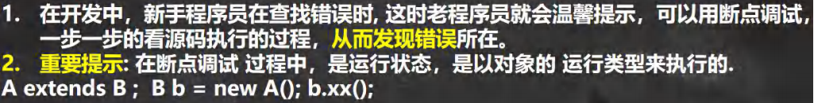

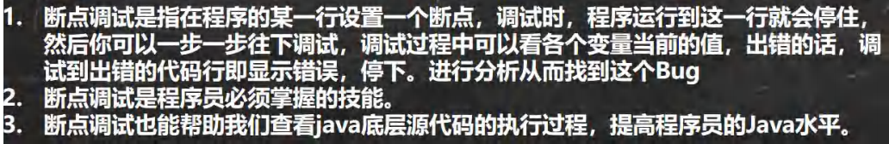

F7(跳入) F8(跳过) 

shift+F8(跳出) F9(resume,执行到下一个断点)

F7：跳入方法内

F8: 逐行执行代码. 

shift+F8: 

跳出方法

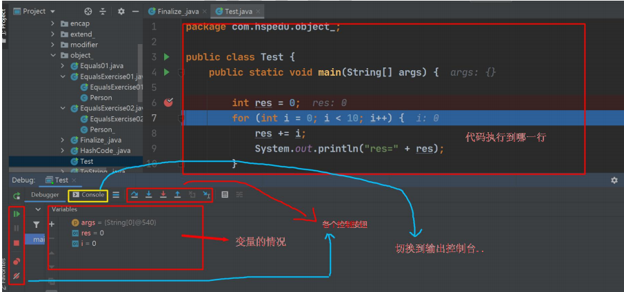


