# 一、包装类

## （一）基本介绍

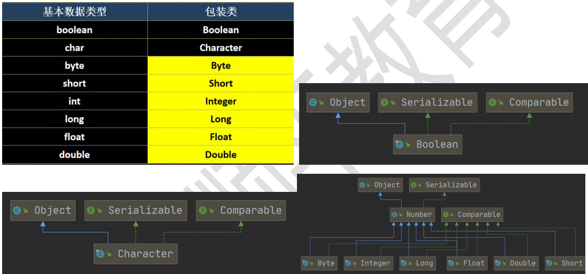

## （二）包装类和基本类型的转换

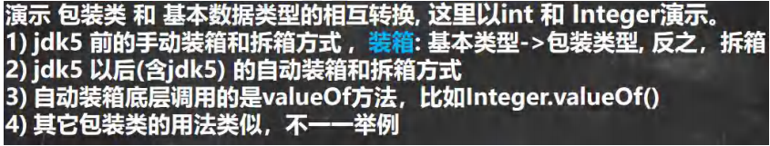

```java
public class Integer01 {
public static void main(String[] args) {
//演示 int <--> Integer 的装箱和拆箱
//jdk5 前是手动装箱和拆箱
//手动装箱 int->Integer
int n1 = 100;
Integer integer = new Integer(n1);
Integer integer1 = Integer.valueOf(n1);
//手动拆箱
//Integer -> int
int i = integer.intValue();
//jdk5 后，就可以自动装箱和自动拆箱
int n2 = 200;
//自动装箱 int->Integer
Integer integer2 = n2; //底层使用的是 Integer.valueOf(n2)
//自动拆箱 Integer->int
int n3 = integer2; //底层仍然使用的是 intValue()方法
}
}
```

## （三）包装类型和 String 类型的相互转换

```java
public class WrapperVSString {
public static void main(String[] args) {
//包装类(Integer)->String
Integer i = 100;//自动装箱
//方式 1
String str1 = i + "";
//方式 2
String str2 = i.toString();
//方式 3
String str3 = String.valueOf(i);
//String -> 包装类(Integer)
String str4 = "12345";
Integer i2 = Integer.parseInt(str4);//使用到自动装箱
Integer i3 = new Integer(str4);//构造器
System.out.println("ok~~");
}
}
```

## （四）Integer 类和 Character 类的常用方法

```java
public class WrapperMethod {
public static void main(String[] args) {
System.out.println(Integer.MIN_VALUE); //返回最小值
System.out.println(Integer.MAX_VALUE);//返回最大值
System.out.println(Character.isDigit('a'));//判断是不是数字
System.out.println(Character.isLetter('a'));//判断是不是字母
System.out.println(Character.isUpperCase('a'));//判断是不是大写
System.out.println(Character.isLowerCase('a'));//判断是不是小写
System.out.println(Character.isWhitespace('a'));//判断是不是空格
System.out.println(Character.toUpperCase('a'));//转成大写
System.out.println(Character.toLowerCase('A'));//转成小写
}
}
```

# 二、String类

## （一）基本介绍

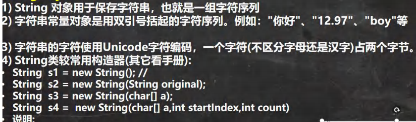

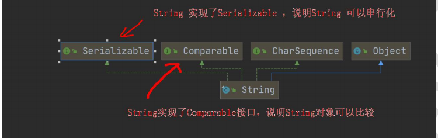

tips：String串行化表明这个对象可以在网络传输

```java
public class String01 {
public static void main(String[] args) {
//1.String 对象用于保存字符串，也就是一组字符序列
//2. "jack" 字符串常量, 双引号括起的字符序列
//3. 字符串的字符使用 Unicode 字符编码，一个字符(不区分字母还是汉字)占两个字节
//4. String 类有很多构造器，构造器的重载
// 常用的有 String s1 = new String(); //
//String s2 = new String(String original);
//String s3 = new String(char[] a);
//String s4 = new String(char[] a,int startIndex,int count)
//String s5 = new String(byte[] b)
//5. String 类实现了接口 Serializable【String 可以串行化:可以在网络传输】
// 接口 Comparable [String 对象可以比较大小]
//6. String 是 final 类，不能被其他的类继承
//7. String 有属性 private final char value[]; 用于存放字符串内容
//8. 一定要注意：value 是一个 final 类型， 不可以修改(需要功力)：即 value 不能指向
// 新的地址，但是单个字符内容是可以变化
String name = "jack";
name = "tom";
final char[] value = {'a','b','c'};
char[] v2 = {'t','o','m'};
value[0] = 'H';
//value = v2; 不可以修改 value 地址
}
}
```

## （二）创建 String 对象的两种方式与区别

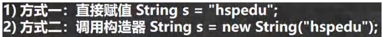


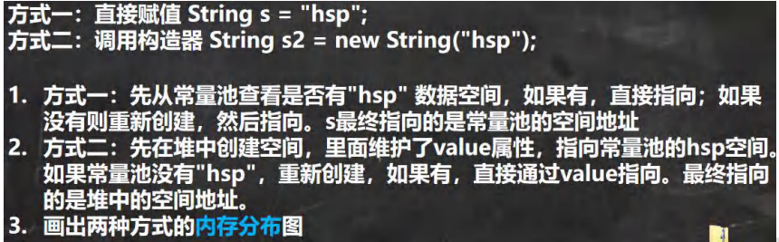

内存图

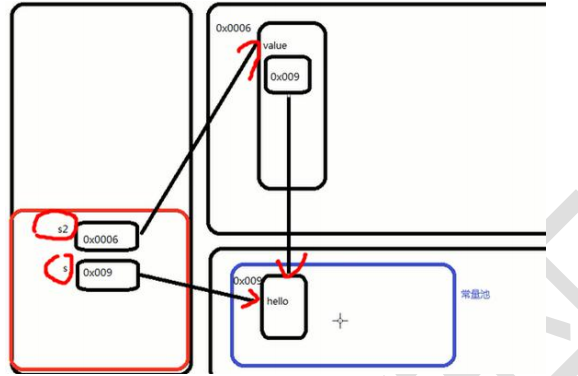

测试题 1

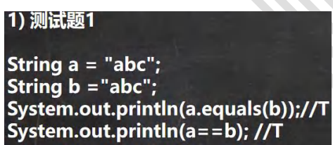

答案

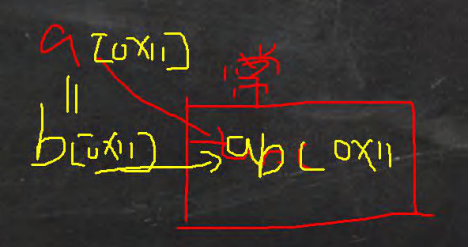

测试题 2

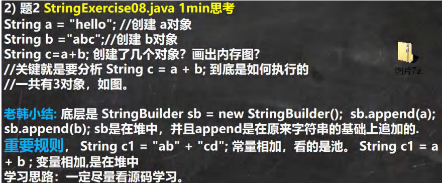

## （三）String的常见方法

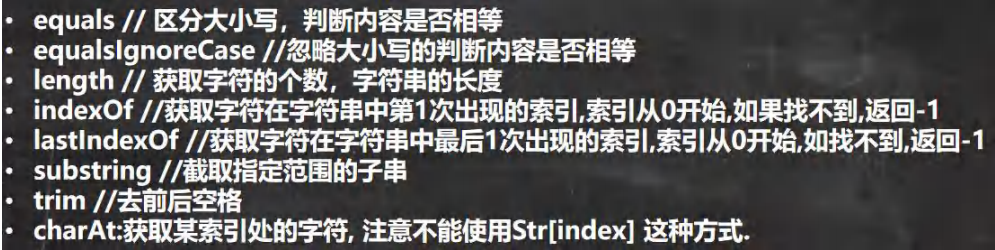


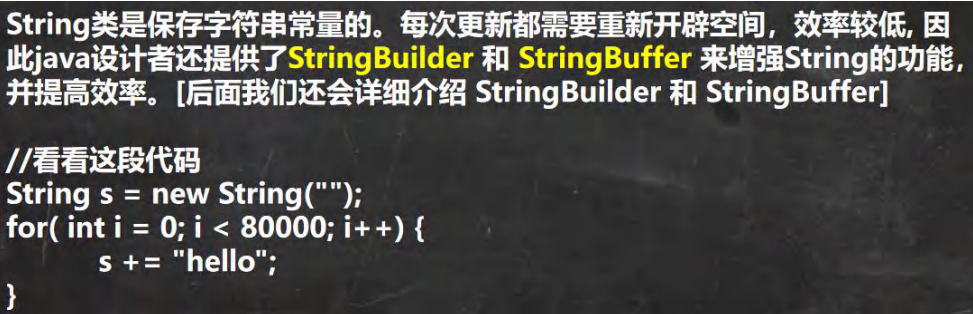

```java
public class StringMethod01 {
public static void main(String[] args) {
//1. equals 前面已经讲过了. 比较内容是否相同，区分大小写
String str1 = "hello";
String str2 = "Hello";
System.out.println(str1.equals(str2));//
// 2.equalsIgnoreCase 忽略大小写的判断内容是否相等
String username = "johN";
if ("john".equalsIgnoreCase(username)) {
System.out.println("Success!");
} else {
System.out.println("Failure!");
}
// 3.length 获取字符的个数，字符串的长度
System.out.println("韩顺平".length());
// 4.indexOf 获取字符在字符串对象中第一次出现的索引，索引从 0 开始，如果找不到，返回-1
String s1 = "wer@terwe@g";
int index = s1.indexOf('@');
System.out.println(index);// 3
System.out.println("weIndex=" + s1.indexOf("we"));//0
// 5.lastIndexOf 获取字符在字符串中最后一次出现的索引，索引从 0 开始，如果找不到，返回-1
s1 = "wer@terwe@g@";
index = s1.lastIndexOf('@');
System.out.println(index);//11
System.out.println("ter 的位置=" + s1.lastIndexOf("ter"));//4
// 6.substring 截取指定范围的子串
String name = "hello,张三";
//下面 name.substring(6) 从索引 6 开始截取后面所有的内容
System.out.println(name.substring(6));//截取后面的字符
第 551页
韩顺平循序渐进学 Java 零基础
//name.substring(0,5)表示从索引 0 开始截取，截取到索引 5-1=4 位置
System.out.println(name.substring(2,5));//llo
}
}
```

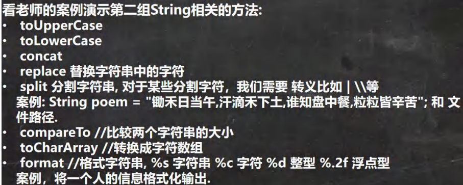

```java
public class StringMethod02 {
public static void main(String[] args) {
// 1.toUpperCase 转换成大写
String s = "heLLo";
System.out.println(s.toUpperCase());//HELLO
// 2.toLowerCase
System.out.println(s.toLowerCase());//hello
// 3.concat 拼接字符串
String s1 = "宝玉";
s1 = s1.concat("林黛玉").concat("薛宝钗").concat("together");
System.out.println(s1);//宝玉林黛玉薛宝钗 together
// 4.replace 替换字符串中的字符
s1 = "宝玉 and 林黛玉 林黛玉 林黛玉";
//在 s1 中，将 所有的 林黛玉 替换成薛宝钗
// 老韩解读: s1.replace() 方法执行后，返回的结果才是替换过的. // 注意对 s1 没有任何影响
String s11 = s1.replace("宝玉", "jack");
System.out.println(s1);//宝玉 and 林黛玉 林黛玉 林黛玉
System.out.println(s11);//jack and 林黛玉 林黛玉 林黛玉
// 5.split 分割字符串, 对于某些分割字符，我们需要 转义比如 | \\等
String poem = "锄禾日当午,汗滴禾下土,谁知盘中餐,粒粒皆辛苦";
//老韩解读：
// 1. 以 , 为标准对 poem 进行分割 , 返回一个数组
// 2. 在对字符串进行分割时，如果有特殊字符，需要加入 转义符 \
String[] split = poem.split(",");
poem = "E:\\aaa\\bbb";
split = poem.split("\\\\");
System.out.println("==分割后内容===");
for (int i = 0; i < split.length; i++) {
System.out.println(split[i]);
}
// 6.toCharArray 转换成字符数组
s = "happy";
char[] chs = s.toCharArray();
for (int i = 0; i < chs.length; i++) {
System.out.println(chs[i]);
}
// 7.compareTo 比较两个字符串的大小，如果前者大，
// 则返回正数，后者大，则返回负数，如果相等，返回 0
// 老韩解读
// (1) 如果长度相同，并且每个字符也相同，就返回 0
// (2) 如果长度相同或者不相同，但是在进行比较时，可以区分大小
// 就返回 if (c1 != c2) {
// return c1 - c2;
// }
// (3) 如果前面的部分都相同，就返回 str1.len - str2.len
String a = "jcck";// len = 3
String b = "jack";// len = 4
System.out.println(a.compareTo(b)); // 返回值是 'c' - 'a' = 2 的值
// 8.format 格式字符串
/* 占位符有:
* %s 字符串 %c 字符 %d 整型 %.2f 浮点型
*
*/
String name = "john";
int age = 10;
double score = 56.857;
char gender = '男';
//将所有的信息都拼接在一个字符串. String info =
"我的姓名是" + name + "年龄是" + age + ",成绩是" + score + "性别是" + gender + "。希望大家喜欢我！
";
System.out.println(info);
//老韩解读
//1. %s , %d , %.2f %c 称为占位符
//2. 这些占位符由后面变量来替换
//3. %s 表示后面由 字符串来替换
//4. %d 是整数来替换
//5. %.2f 表示使用小数来替换，替换后，只会保留小数点两位, 并且进行四舍五入的处理
//6. %c 使用 char 类型来替换
String formatStr = "我的姓名是%s 年龄是%d，成绩是%.2f 性别是%c.希望大家喜欢我！";
String info2 = String.format(formatStr, name, age, score, gender);
System.out.println("info2=" + info2);
}
}
```

## （四）StirngBuffer类

### 1、基本介绍

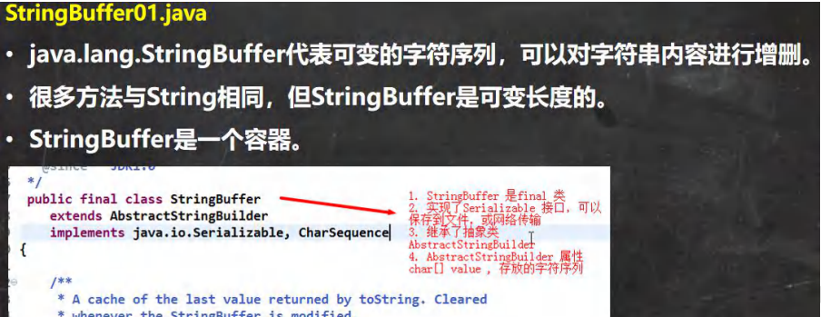

### 2、String VS StringBuffer

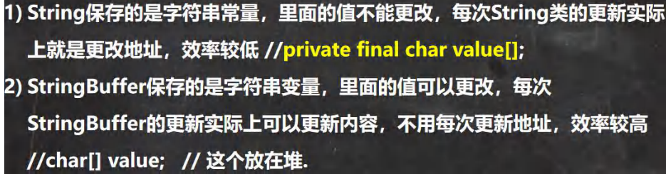

- String的value值（地址）不能变，因为有final修饰，它所指向的地址在常量池
- 对于一个final数据，如果是基本数据类型的变量，则其赋值一旦初始化之后就不能在修改
- 如果是引用类型的变量，则在对其初始化之后便不能再让其指向另一个对象

### 3、String 和 StringBuffer 相互转换

```java
public class StringAndStringBuffer {
public static void main(String[] args) {
//看 String——>StringBuffer
String str = "hello tom";
//方式 1 使用构造器
//注意： 返回的才是 StringBuffer 对象，对 str 本身没有影响
StringBuffer stringBuffer = new StringBuffer(str);
//方式 2 使用的是 append 方法
StringBuffer stringBuffer1 = new StringBuffer();
stringBuffer1 = stringBuffer1.append(str);
//看看 StringBuffer ->String
StringBuffer stringBuffer3 = new StringBuffer("韩顺平教育");
//方式 1 使用 StringBuffer 提供的 toString 方法
String s = stringBuffer3.toString();
//方式 2: 使用构造器来搞定
String s1 = new String(stringBuffer3);
}
}
```

### 4、StringBuffer常用的方法

```java
public class StringBufferMethod {
public static void main(String[] args) {
StringBuffer s = new StringBuffer("hello");
//增
s.append(',');// "hello,"
s.append("张三丰");//"hello,张三丰"
s.append("赵敏").append(100).append(true).append(10.5);//"hello,张三丰赵敏 100true10.5" System.out.println(s);//"hello,张三丰赵敏 100true10.5"
//删
/*
* 删除索引为>=start && <end 处的字符
* 解读: 删除 11~14 的字符 [11, 14)
*/
s.delete(11, 14);
System.out.println(s);//"hello,张三丰赵敏 true10.5"
//改
//老韩解读，使用 周芷若 替换 索引 9-11 的字符 [9,11)
s.replace(9, 11, "周芷若");
System.out.println(s);//"hello,张三丰周芷若 true10.5"
//查找指定的子串在字符串第一次出现的索引，如果找不到返回-1
int indexOf = s.indexOf("张三丰");
System.out.println(indexOf);//6
//插
//老韩解读，在索引为 9 的位置插入 "赵敏",原来索引为 9 的内容自动后移
s.insert(9, "赵敏");
System.out.println(s);//"hello,张三丰赵敏周芷若 true10.5"
//长度
System.out.println(s.length());//22
System.out.println(s);
}
}
```

## （五）StringBuilder类

### 1、基本介绍

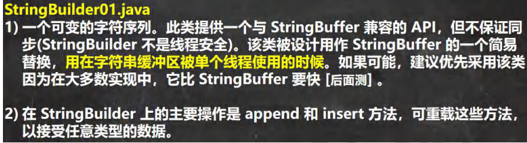

### 2、应用

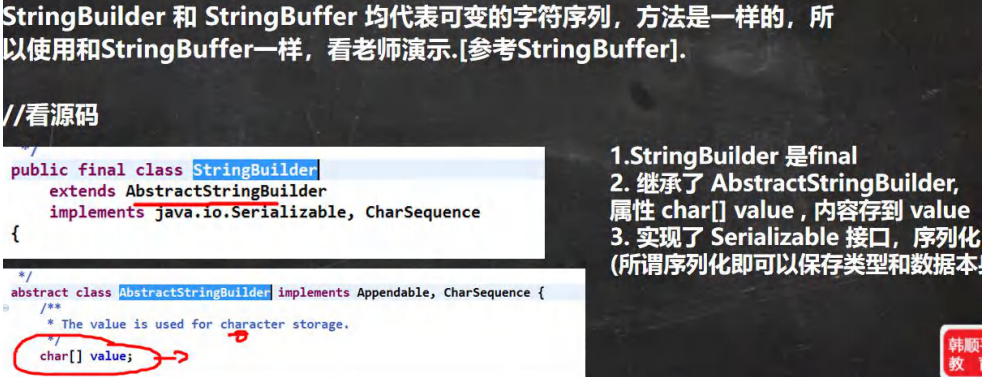


## （六）String、StringBuffer 和 StringBuilder 的比较

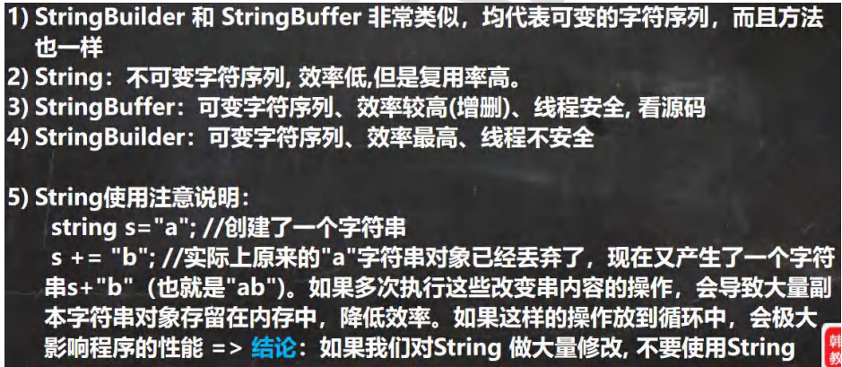

## （七）String、StringBuffer 和 StringBuilder 的选择

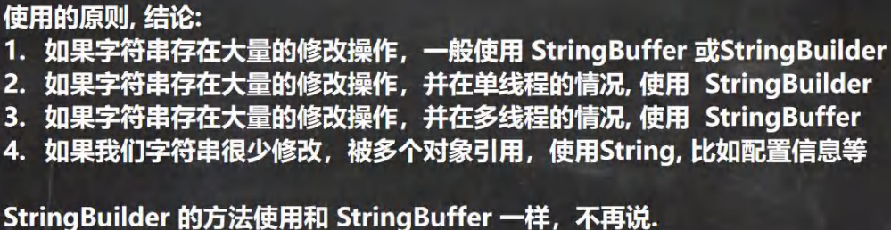

# 三、Math类

## （一）基本介绍

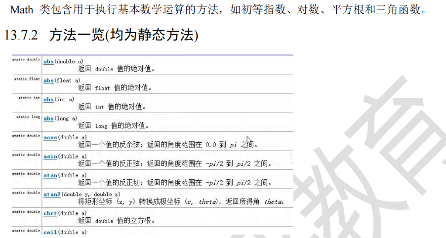

# 四、Arrays类

## （一）基本介绍

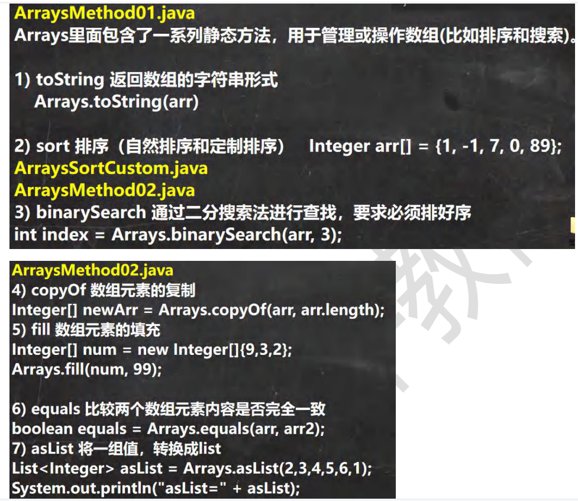

```java
public class ArraysMethod01 {
public static void main(String[] args) {
Integer[] integers = {1, 20, 90};
//遍历数组
// for(int i = 0; i < integers.length; i++) {
// System.out.println(integers[i]);
// }
//直接使用 Arrays.toString 方法，显示数组
// System.out.println(Arrays.toString(integers));//
//演示 sort 方法的使用
Integer arr[] = {1, -1, 7, 0, 89};
//进行排序
//老韩解读
//1. 可以直接使用冒泡排序 , 也可以直接使用 Arrays 提供的 sort 方法排序
//2. 因为数组是引用类型，所以通过 sort 排序后，会直接影响到 实参 arr
//3. sort 重载的，也可以通过传入一个接口 Comparator 实现定制排序
//4. 调用 定制排序 时，传入两个参数 (1) 排序的数组 arr
// (2) 实现了 Comparator 接口的匿名内部类 , 要求实现 compare 方法
//5. 先演示效果，再解释
//6. 这里体现了接口编程的方式 , 看看源码，就明白
// 源码分析
//(1) Arrays.sort(arr, new Comparator()
//(2) 最终到 TimSort 类的 private static <T> void binarySort(T[] a, int lo, int hi, int start, // Comparator<? super T> c)()
//(3) 执行到 binarySort 方法的代码, 会根据动态绑定机制 c.compare()执行我们传入的
// 匿名内部类的 compare ()
// while (left < right) {
// int mid = (left + right) >>> 1;
// if (c.compare(pivot, a[mid]) < 0)
// right = mid;
// else
// left = mid + 1;
// }
//(4) new Comparator() {
// @Override
// public int compare(Object o1, Object o2) {
// Integer i1 = (Integer) o1;
// Integer i2 = (Integer) o2;
// return i2 - i1;
// }
// }
//(5) public int compare(Object o1, Object o2) 返回的值>0 还是 <0
// 会影响整个排序结果, 这就充分体现了 接口编程+动态绑定+匿名内部类的综合使用
// 将来的底层框架和源码的使用方式，会非常常见
//Arrays.sort(arr); // 默认排序方法
//定制排序
Arrays.sort(arr, new Comparator() {
@Override
public int compare(Object o1, Object o2) {
Integer i1 = (Integer) o1;
Integer i2 = (Integer) o2;
return i2 - i1;
}
});
System.out.println("===排序后===");
System.out.println(Arrays.toString(arr));//
}
}
package com.hspedu.arrays_;
import java.util.Arrays;
import java.util.Comparator;
public class ArraysSortCustom {
public static void main(String[] args) {
int[] arr = {1, -1, 8, 0, 20};
//bubble01(arr);
bubble02(arr, new Comparator() {
@Override
public int compare(Object o1, Object o2) {
int i1 = (Integer) o1;
int i2 = (Integer) o2;
return i2 - i1;// return i2 - i1;
}
});
System.out.println("==定制排序后的情况==");
System.out.println(Arrays.toString(arr));
}
//使用冒泡完成排序
public static void bubble01(int[] arr) {
int temp = 0;
for (int i = 0; i < arr.length - 1; i++) {
for (int j = 0; j < arr.length - 1 - i; j++) {
//从小到大
if (arr[j] > arr[j + 1]) {
temp = arr[j];
arr[j] = arr[j + 1];
arr[j + 1] = temp;
}
}
}
}
//结合冒泡 + 定制
public static void bubble02(int[] arr, Comparator c) {
int temp = 0;
for (int i = 0; i < arr.length - 1; i++) {
for (int j = 0; j < arr.length - 1 - i; j++) {
//数组排序由 c.compare(arr[j], arr[j + 1])返回的值决定
if (c.compare(arr[j], arr[j + 1]) > 0) {
temp = arr[j];
arr[j] = arr[j + 1];
arr[j + 1] = temp;
}
}
}
}
}
package com.hspedu.arrays_;
import java.util.Arrays;
import java.util.List;
public class ArraysMethod02 {
public static void main(String[] args) {
Integer[] arr = {1, 2, 90, 123, 567};
// binarySearch 通过二分搜索法进行查找，要求必须排好
// 老韩解读
//1. 使用 binarySearch 二叉查找
//2. 要求该数组是有序的. 如果该数组是无序的，不能使用 binarySearch
//3. 如果数组中不存在该元素，就返回 return -(low + 1); // key not found. int index = Arrays.binarySearch(arr, 567);
System.out.println("index=" + index);
//copyOf 数组元素的复制
// 老韩解读
//1. 从 arr 数组中，拷贝 arr.length 个元素到 newArr 数组中
//2. 如果拷贝的长度 > arr.length 就在新数组的后面 增加 null
//3. 如果拷贝长度 < 0 就抛出异常 NegativeArraySizeException
//4. 该方法的底层使用的是 System.arraycopy()
Integer[] newArr = Arrays.copyOf(arr, arr.length);
System.out.println("==拷贝执行完毕后==");
System.out.println(Arrays.toString(newArr));
//ill 数组元素的填充
Integer[] num = new Integer[]{9,3,2};
//老韩解读
//1. 使用 99 去填充 num 数组，可以理解成是替换原理的元素
Arrays.fill(num, 99);
System.out.println("==num 数组填充后==");
System.out.println(Arrays.toString(num));
//equals 比较两个数组元素内容是否完全一致
Integer[] arr2 = {1, 2, 90, 123};
//老韩解读
//1. 如果 arr 和 arr2 数组的元素一样，则方法 true;
//2. 如果不是完全一样，就返回 false
boolean equals = Arrays.equals(arr, arr2);
System.out.println("equals=" + equals);
//asList 将一组值，转换成 list
//老韩解读
//1. asList 方法，会将 (2,3,4,5,6,1)数据转成一个 List 集合
//2. 返回的 asList 编译类型 List(接口)
//3. asList 运行类型 java.util.Arrays#ArrayList, 是 Arrays 类的
// 静态内部类 private static class ArrayList<E> extends AbstractList<E>
// implements RandomAccess, java.io.Serializable
List asList = Arrays.asList(2,3,4,5,6,1);
System.out.println("asList=" + asList);
System.out.println("asList 的运行类型" + asList.getClass());
}
}
```

# 五、System类

## （一）基本介绍

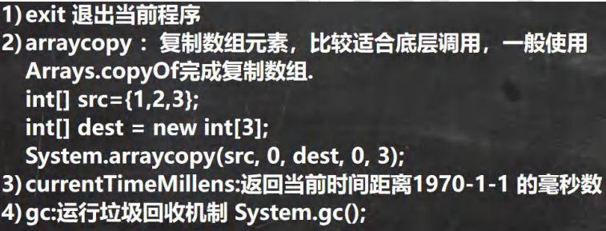

```java
public class System_ {
public static void main(String[] args) {
//exit 退出当前程序
// System.out.println("ok1");
// //老韩解读
// //1. exit(0) 表示程序退出
// //2. 0 表示一个状态 , 正常的状态
// System.exit(0);//
// System.out.println("ok2");
//arraycopy ：复制数组元素，比较适合底层调用，
// 一般使用 Arrays.copyOf 完成复制数组
int[] src={1,2,3};
int[] dest = new int[3];// dest 当前是 {0,0,0}
//老韩解读
//1. 主要是搞清楚这五个参数的含义
//2. // 源数组
// * @param src the source array. // srcPos： 从源数组的哪个索引位置开始拷贝
// * @param srcPos starting position in the source array. // dest : 目标数组，即把源数组的数据拷贝到哪个数组
// * @param dest the destination array. // destPos: 把源数组的数据拷贝到 目标数组的哪个索引
// * @param destPos starting position in the destination data. // length: 从源数组拷贝多少个数据到目标数组
// * @param length the number of array elements to be copied. System.arraycopy(src, 0, dest, 0, src.length);
// int[] src={1,2,3};
System.out.println("dest=" + Arrays.toString(dest));//[1, 2, 3]
//currentTimeMillens:返回当前时间距离 1970-1-1 的毫秒数
// 老韩解读:
System.out.println(System.currentTimeMillis());
}
}
```

## （二）BigInteger 和 BigDecimal 常见方法

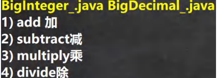

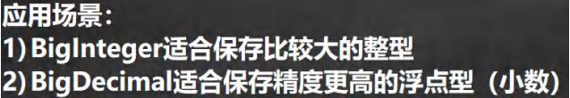

```java
public class BigInteger_ {
public static void main(String[] args) {
//当我们编程中，需要处理很大的整数，long 不够用
//可以使用 BigInteger 的类来搞定
// long l = 23788888899999999999999999999l;
// System.out.println("l=" + l);
BigInteger bigInteger = new BigInteger("23788888899999999999999999999");
BigInteger bigInteger2 = new
韩顺平循序渐进学 Java 零基础
BigInteger("10099999999999999999999999999999999999999999999999999999999999999999999999999999999");
System.out.println(bigInteger);
//老韩解读
//1. 在对 BigInteger 进行加减乘除的时候，需要使用对应的方法，不能直接进行 + - * /
//2. 可以创建一个 要操作的 BigInteger 然后进行相应操作
BigInteger add = bigInteger.add(bigInteger2);
System.out.println(add);//
BigInteger subtract = bigInteger.subtract(bigInteger2);
System.out.println(subtract);//减
BigInteger multiply = bigInteger.multiply(bigInteger2);
System.out.println(multiply);//乘
BigInteger divide = bigInteger.divide(bigInteger2);
System.out.println(divide);//除
}
}
package com.hspedu.bignum;
import java.math.BigDecimal;
/**
* @author 韩顺平
* @version 1.0
*/
public class BigDecimal_ {
public static void main(String[] args) {
//当我们需要保存一个精度很高的数时，double 不够用
//可以是 BigDecimal
// double d = 1999.11111111111999999999999977788d;
// System.out.println(d);
BigDecimal bigDecimal = new BigDecimal("1999.11");
BigDecimal bigDecimal2 = new BigDecimal("3");
System.out.println(bigDecimal);
//老韩解读
//1. 如果对 BigDecimal 进行运算，比如加减乘除，需要使用对应的方法
//2. 创建一个需要操作的 BigDecimal 然后调用相应的方法即可
System.out.println(bigDecimal.add(bigDecimal2));
System.out.println(bigDecimal.subtract(bigDecimal2));
System.out.println(bigDecimal.multiply(bigDecimal2));
//System.out.println(bigDecimal.divide(bigDecimal2));//可能抛出异常 ArithmeticException
//在调用 divide 方法时，指定精度即可. BigDecimal.ROUND_CEILING
//如果有无限循环小数，就会保留 分子 的精度
System.out.println(bigDecimal.divide(bigDecimal2, BigDecimal.ROUND_CEILING));
}
}
```

# 六、日期类

## （一）基本介绍

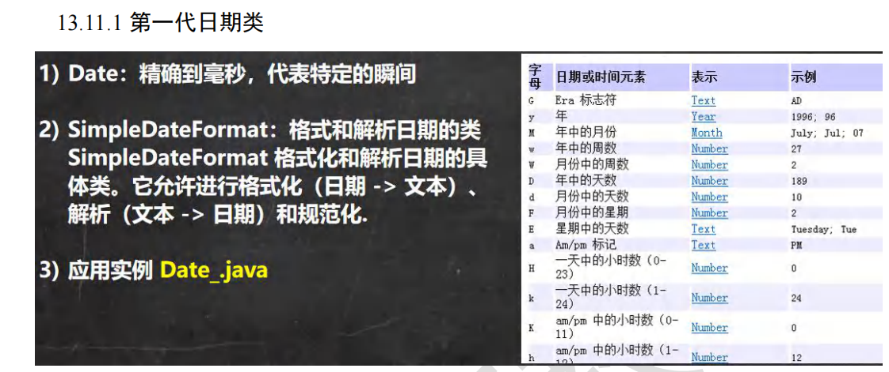


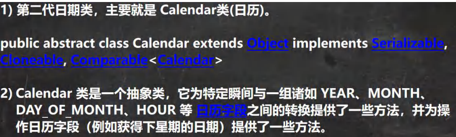

```java
public class Calendar_ {
public static void main(String[] args) {
//老韩解读
//1. Calendar 是一个抽象类， 并且构造器是 private
//2. 可以通过 getInstance() 来获取实例
//3. 提供大量的方法和字段提供给程序员
//4. Calendar 没有提供对应的格式化的类，因此需要程序员自己组合来输出(灵活)
//5. 如果我们需要按照 24 小时进制来获取时间， Calendar.HOUR ==改成=> Calendar.HOUR_OF_DAY
Calendar c = Calendar.getInstance(); //创建日历类对象//比较简单，自由
System.out.println("c=" + c);
//2.获取日历对象的某个日历字段
System.out.println("年：" + c.get(Calendar.YEAR));
// 这里为什么要 + 1, 因为 Calendar 返回月时候，是按照 0 开始编号
System.out.println("月：" + (c.get(Calendar.MONTH) + 1));
System.out.println("日：" + c.get(Calendar.DAY_OF_MONTH));
System.out.println("小时：" + c.get(Calendar.HOUR));
System.out.println("分钟：" + c.get(Calendar.MINUTE));
System.out.println("秒：" + c.get(Calendar.SECOND));
//Calender 没有专门的格式化方法，所以需要程序员自己来组合显示
System.out.println(c.get(Calendar.YEAR) + "-" + (c.get(Calendar.MONTH) + 1) + "-" +
c.get(Calendar.DAY_OF_MONTH) +
" " + c.get(Calendar.HOUR_OF_DAY) + ":" + c.get(Calendar.MINUTE) + ":" + c.get(Calendar.SECOND) );
}
}
```


**第三代日期类**

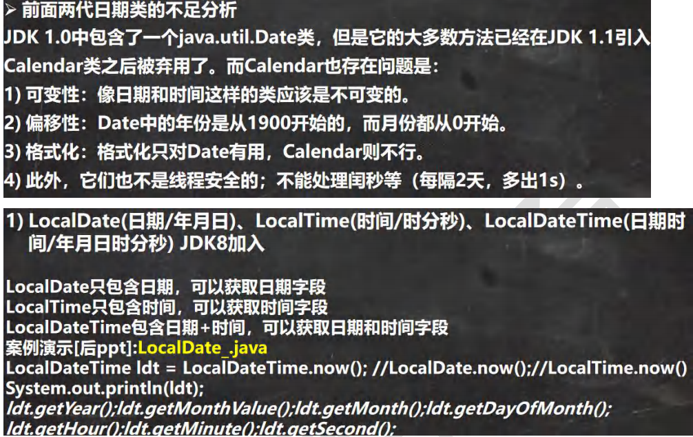

## （二）DateTimeFormatter 格式日期类

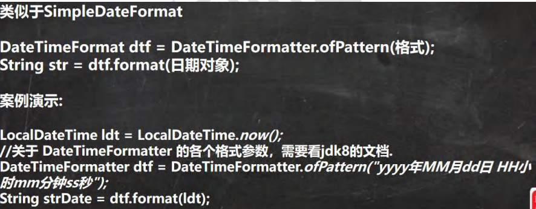

## （三）时间戳

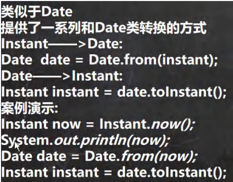

