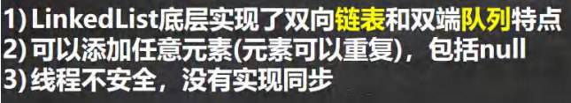
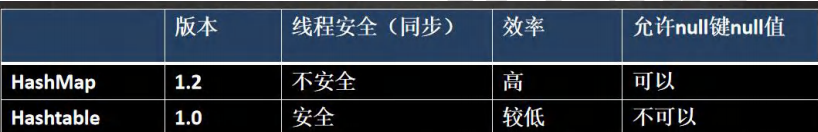

# **一、集合**

## （一）基本介绍

### 1、数组


### 2、集合


## （二）集合的框架体系


```java
public class Collection_ {
@SuppressWarnings({"all"})
public static void main(String[] args) {
//老韩解读
//1. 集合主要是两组(单列集合 , 双列集合)
//2. Collection 接口有两个重要的子接口 List Set , 他们的实现子类都是单列集合
//3. Map 接口的实现子类 是双列集合，存放的 K-V
//4. 把老师梳理的两张图记住
//Collection
//Map
ArrayList arrayList = new ArrayList();
arrayList.add("jack");
arrayList.add("tom");
HashMap hashMap = new HashMap();
hashMap.put("NO1", "北京");
hashMap.put("NO2", "上海");
}
}
```


# **二、Collection类的接口和常用方法**

## （一）Collection 接口实现类的特点

1. add：添加单个元素
2. remove：删除指定元素
3. contains：查找元素是否存在0
4. size：获取元素个数
5. isEmpty：判断是否为空
6. clear：清空
7. addAll:添加多个元素
8. containsAll：差找多个元素是否存在
9. removeAll：删除多个元素

```java
public class CollectionMethod {
@SuppressWarnings({"all"})
public static void main(String[] args) {
List list = new ArrayList();
// add:添加单个元素
list.add("jack");
list.add(10);//list.add(new Integer(10))
list.add(true);
System.out.println("list=" + list);
// remove:删除指定元素
//list.remove(0);//删除第一个元素
list.remove(true);//指定删除某个元素
System.out.println("list=" + list);
// contains:查找元素是否存在
System.out.println(list.contains("jack"));//T
// size:获取元素个数
System.out.println(list.size());//2
// isEmpty:判断是否为空
System.out.println(list.isEmpty());//F
// clear:清空
list.clear();
System.out.println("list=" + list);
// addAll:添加多个元素
ArrayList list2 = new ArrayList();
list2.add("红楼梦");
list2.add("三国演义");
list.addAll(list2);
System.out.println("list=" + list);
// containsAll:查找多个元素是否都存在
System.out.println(list.containsAll(list2));//T
// removeAll：删除多个元素
list.add("聊斋");
list.removeAll(list2);
System.out.println("list=" + list);//[聊斋]
// 说明：以 ArrayList 实现类来演示. }
}
```

## （二）Collection 接口遍历元素方式 1-使用 Iterator(迭代器)


```java
public class CollectionIterator {
@SuppressWarnings({"all"})
public static void main(String[] args) {
Collection col = new ArrayList();
col.add(new Book("三国演义", "罗贯中", 10.1));
col.add(new Book("小李飞刀", "古龙", 5.1));
col.add(new Book("红楼梦", "曹雪芹", 34.6));
//System.out.println("col=" + col);
//现在老师希望能够遍历 col 集合
//1. 先得到 col 对应的 迭代器
Iterator iterator = col.iterator();
//2. 使用 while 循环遍历
// while (iterator.hasNext()) {//判断是否还有数据
// //返回下一个元素，类型是 Object
// Object obj = iterator.next();
// System.out.println("obj=" + obj);
// }
//老师教大家一个快捷键，快速生成 while => itit
//显示所有的快捷键的的快捷键 ctrl + j
while (iterator.hasNext()) {
Object obj = iterator.next();
System.out.println("obj=" + obj);
}
//3. 当退出 while 循环后 , 这时 iterator 迭代器，指向最后的元素
// iterator.next();//NoSuchElementException
//4. 如果希望再次遍历，需要重置我们的迭代器
iterator = col.iterator();
System.out.println("===第二次遍历===");
while (iterator.hasNext()) {
Object obj = iterator.next();
System.out.println("obj=" + obj);
}
}
}
class Book {
private String name;
private String author;
private double price;
public Book(String name, String author, double price) {
this.name = name;
this.author = author;
this.price = price;
}
public String getName() {
return name;
}
public void setName(String name) {
this.name = name;
}
public String getAuthor() {
return author;
}
public void setAuthor(String author) {
this.author = author;
}
public double getPrice() {
return price;
}
public void setPrice(double price) {
this.price = price;
}
@Override
public String toString() {
return "Book{" +
"name='" + name + '\'' +
", author='" + author + '\'' +
", price=" + price +
'}';
}
}
```

## （三）Collection 接口遍历对象方式 2-for 循环增强


# **三、List接口和常用方法**

## （一）基本介绍


```java
public class List_ {
@SuppressWarnings({"all"})
public static void main(String[] args) {
//1. List 集合类中元素有序(即添加顺序和取出顺序一致)、且可重复 [案例]
List list = new ArrayList();
list.add("jack");
list.add("tom");
list.add("mary");
list.add("hsp");
list.add("tom");
System.out.println("list=" + list);
//2. List 集合中的每个元素都有其对应的顺序索引，即支持索引
// 索引是从 0 开始的
System.out.println(list.get(3));//hsp
//3. }
}
```

## （二）常用方法

```java
public class ListMethod {
@SuppressWarnings({"all"})
public static void main(String[] args) {
List list = new ArrayList();
list.add("张三丰");
list.add("贾宝玉");
// void add(int index, Object ele):在 index 位置插入 ele 元素
//在 index = 1 的位置插入一个对象
list.add(1, "韩顺平");
System.out.println("list=" + list);
// boolean addAll(int index, Collection eles):从 index 位置开始将 eles 中的所有元素添加进来
List list2 = new ArrayList();
list2.add("jack");
list2.add("tom");
list.addAll(1, list2);
System.out.println("list=" + list);
// Object get(int index):获取指定 index 位置的元素
//说过
// int indexOf(Object obj):返回 obj 在集合中首次出现的位置
System.out.println(list.indexOf("tom"));//2
// int lastIndexOf(Object obj):返回 obj 在当前集合中末次出现的位置
list.add("韩顺平");
System.out.println("list=" + list);
System.out.println(list.lastIndexOf("韩顺平"));
// Object remove(int index):移除指定 index 位置的元素，并返回此元素
list.remove(0);
System.out.println("list=" + list);
// Object set(int index, Object ele):设置指定 index 位置的元素为 ele , 相当于是替换. list.set(1, "玛丽");
System.out.println("list=" + list);
// List subList(int fromIndex, int toIndex):返回从 fromIndex 到 toIndex 位置的子集合
// 注意返回的子集合 fromIndex <= subList < toIndex
List returnlist = list.subList(0, 2);
System.out.println("returnlist=" + returnlist);
}
}
```

## （三）List接口的三种遍历方式


```java
public static void main(String[] args) {
//List 接口的实现子类 Vector LinkedList
//List list = new ArrayList();
//List list = new Vector();
List list = new LinkedList();
list.add("jack");
list.add("tom");
list.add("鱼香肉丝");
list.add("北京烤鸭子");
//遍历
//1. 迭代器
Iterator iterator = list.iterator();
while (iterator.hasNext()) {
Object obj = iterator.next();
System.out.println(obj);
}
System.out.println("=====增强 for=====");
//2. 增强 for
for (Object o : list) {
System.out.println("o=" + o);
}
System.out.println("=====普通 for====");
//3. 使用普通 for
for (int i = 0; i < list.size(); i++) {
System.out.println("对象=" + list.get(i));
}
}
}
```

## （四）ArrayList的注意事项


```java
public static void main(String[] args) {
//老韩解读源码
//注意，注意，注意，Idea 默认情况下，Debug 显示的数据是简化后的，如果希望看到完整的数据
//需要做设置. //使用无参构造器创建 ArrayList 对象
//ArrayList list = new ArrayList();
ArrayList list = new ArrayList(8);
//使用 for 给 list 集合添加 1-10 数据
for (int i = 1; i <= 10; i++) {
list.add(i);
}
//使用 for 给 list 集合添加 11-15 数据
for (int i = 11; i <= 15; i++) {
list.add(i);
}
list.add(100);
list.add(200);
list.add(null);
}
}
```


- 在if（minCapacity  - elementData.length > 0）minCapacity是最少需要的空间大小，elementData.length是实际上有多少空间
- 最开始初始化时if（minCapacity  - elementData.length > 0）时，minCapacity（最少需要的空间大小）为1（实际上有多少空间）为0，而elementData.length，调用grow方法，不成立就返回
- 第二次执行if（minCapacity  - elementData.length > 0）时minCapacity实际上为2，elementData.length经过第一次扩容以后大小为10

# **四、Vector 底层结构和源码剖析**

## （一）基本介绍


## （二）Vector 和 ArrayList 的比较


# **五、LinkedList 底层结构**

## （一）基本介绍



## （二）LinkedList 的底层操作机制


## （三）ArrayList 和 LinkedList 比较


- 两者都讲尽量使用在单线程中

# **六、Set 接口和常用方法**

## （一）基本介绍


- HashSet的底层是HashMap

```java
public class SetMethod {
public static void main(String[] args) {
//老韩解读
//1. 以 Set 接口的实现类 HashSet 来讲解 Set 接口的方法
//2. set 接口的实现类的对象(Set 接口对象), 不能存放重复的元素, 可以添加一个 null
//3. set 接口对象存放数据是无序(即添加的顺序和取出的顺序不一致)
//4. 注意：取出的顺序的顺序虽然不是添加的顺序，但是他的固定. Set set = new HashSet();
set.add("john");
set.add("lucy");
set.add("john");//重复
set.add("jack");
set.add("hsp");
set.add("mary");
set.add(null);//
set.add(null);//再次添加 null
for(int i = 0; i <10;i ++) {
System.out.println("set=" + set);
}
//遍历
//方式 1： 使用迭代器
System.out.println("=====使用迭代器====");
Iterator iterator = set.iterator();
while (iterator.hasNext()) {
Object obj = iterator.next();
System.out.println("obj=" + obj);
}
set.remove(null);
//方式 2: 增强 for
System.out.println("=====增强 for====");
for (Object o : set) {
System.out.println("o=" + o);
}
//set 接口对象，不能通过索引来获取
}
}
```

## （二）HashSet 的全面说明


## （三）HashSet 底层机制说明


```java
public class HashSetSource {
public static void main(String[] args) {
HashSet hashSet = new HashSet();
hashSet.add("java");//到此位置，第 1 次 add 分析完毕. hashSet.add("php");//到此位置，第 2 次 add 分析完毕
hashSet.add("java");
System.out.println("set=" + hashSet);

老韩对 HashSet 的源码解读
1. 执行 HashSet()
public HashSet() {
map = new HashMap<>();
}
2. 执行 add()
public boolean add(E e) {//e = "java"
return map.put(e, PRESENT)==null;//(static) PRESENT = new Object();
}
3.执行 put() , 该方法会执行 hash(key) 得到 key 对应的 hash 值 算法 h = key.hashCode()) ^ (h >>> 16)
public V put(K key, V value) {//key = "java" value = PRESENT 共享
return putVal(hash(key), key, value, false, true);
}

4.执行 putVal
final V putVal(int hash, K key, V value, boolean onlyIfAbsent, boolean evict) {
Node<K,V>[] tab; Node<K,V> p; int n, i; //定义了辅助变量
//table 就是 HashMap 的一个数组，类型是 Node[]
//if 语句表示如果当前 table 是 null, 或者 大小=0
//就是第一次扩容，到 16 个空间. if ((tab = table) == null || (n = tab.length) == 0)
n = (tab = resize()).length;
//(1)根据 key，得到 hash 去计算该 key 应该存放到 table 表的哪个索引位置
//并把这个位置的对象，赋给 p
//(2)判断 p 是否为 null
//(2.1) 如果 p 为 null, 表示还没有存放元素, 就创建一个 Node (key="java",value=PRESENT)
//(2.2) 就放在该位置 tab[i] = newNode(hash, key, value, null)
if ((p = tab[i = (n - 1) & hash]) == null)
tab[i] = newNode(hash, key, value, null);
else {
//一个开发技巧提示： 在需要局部变量(辅助变量)时候，在创建
Node<K,V> e; K k; //
//如果当前索引位置对应的链表的第一个元素和准备添加的 key 的 hash 值一样
//并且满足 下面两个条件之一:
//(1) 准备加入的 key 和 p 指向的 Node 结点的 key 是同一个对象
//(2) p 指向的 Node 结点的 key 的 equals() 和准备加入的 key 比较后相同
// (key != null && key.equals(k)针对的是对象空间不同，但是所指的内容相同
//就不能加入
if (p.hash == hash &&
((k = p.key) == key || (key != null && key.equals(k))))
e = p;
//再判断 p 是不是一颗红黑树, //如果是一颗红黑树，就调用 putTreeVal , 来进行添加
else if (p instanceof TreeNode)
e = ((TreeNode<K,V>)p).putTreeVal(this, tab, hash, key, value);
else {//如果 table 对应索引位置，已经是一个链表, 就使用 for 循环比较
//(1) 依次和该链表的每一个元素比较后，都不相同, 则加入到该链表的最后
// 注意在把元素添加到链表后，立即判断 该链表是否已经达到 8 个结点
// , 就调用 treeifyBin() 对当前这个链表进行树化(转成红黑树)
// 注意，在转成红黑树时，要进行判断, 判断条件
// if (tab == null || (n = tab.length) < MIN_TREEIFY_CAPACITY(64))
// resize();
// 如果上面条件成立，先 table 扩容. // 只有上面条件不成立时，才进行转成红黑树
//(2) 依次和该链表的每一个元素比较过程中，如果有相同情况,就直接 break
for (int binCount = 0; ; ++binCount) {
if ((e = p.next) == null) {
p.next = newNode(hash, key, value, null);
if (binCount >= TREEIFY_THRESHOLD(8) - 1) // -1 for 1st
treeifyBin(tab, hash);
break;
}
if (e.hash == hash &&
((k = e.key) == key || (key != null && key.equals(k))))
break;
p = e;
}
}
if (e != null) { // existing mapping for key
V oldValue = e.value;
if (!onlyIfAbsent || oldValue == null)
e.value = value;
afterNodeAccess(e);
return oldValue;
}
}
++modCount;
//size 就是我们每加入一个结点 Node(k,v,h,next), size++
if (++size > threshold)
resize();//扩容
afterNodeInsertion(evict);
return null;
}
}
}
```


- equals（）方法不能简单的理解成字符串和字符串是否相等，可以由程序员重写来判断标准，比如添加一个person对象时名字和地址相等，它就相同，也可以是一个人的名字和薪水相同就可以理解成相同Sting是重写了equals（）方法的
- 在第一小点中threhold是指当你数组空间用到12时就已经开始扩容，防止用完再扩容导致效率降低
- 16（12）→32（24）→64（48）

# **七、接口类-LinkedHashSet**

## （一）基本介绍


## （二）LinkedHashSet底层机制


# **八、Map接口**

## （一）基本介绍


- Node是HashMap里面的一个内部类
- k-v为了方便程序员遍历，还会创建EntrySet集合（可以理解为EnterSet是HashMap的内部类，entrySet（）是方法），该集合存放的元素的类型是Entry，而一个Entry对象就有k，v
- entrySet中，定义的类型是Map.Entry，但是实际上存放的还是HashMap$Node，简单来说就是node实现了Entry接口
- 把HashMap$Node对象存放到entrySet就方便我们遍历，因为Map.Entry提供了重要的方法

```java
public class Map_ {
public static void main(String[] args) {
//老韩解读 Map 接口实现类的特点, 使用实现类 HashMap
//1. Map 与 Collection 并列存在。用于保存具有映射关系的数据:Key-Value(双列元素)
//2. Map 中的 key 和 value 可以是任何引用类型的数据，会封装到 HashMap$Node 对象中
//3. Map 中的 key 不允许重复，原因和 HashSet 一样，前面分析过源码. //4. Map 中的 value 可以重复
//5. Map 的 key 可以为 null, value 也可以为 null ，注意 key 为 null, 第 664页
// 只能有一个，value 为 null ,可以多个
//6. 常用 String 类作为 Map 的 key
//7. key 和 value 之间存在单向一对一关系，即通过指定的 key 总能找到对应的 value
Map map = new HashMap();
map.put("no1", "韩顺平");//k-v
map.put("no2", "张无忌");//k-v
map.put("no1", "张三丰");//当有相同的 k , 就等价于替换. map.put("no3", "张三丰");//k-v
map.put(null, null); //k-v
map.put(null, "abc"); //等价替换
map.put("no4", null); //k-v
map.put("no5", null); //k-v
map.put(1, "赵敏");//k-v
map.put(new Object(), "金毛狮王");//k-v
// 通过 get 方法，传入 key ,会返回对应的 value
System.out.println(map.get("no2"));//张无忌
System.out.println("map=" + map);
}
}
```

## （二）Map接口常用方法

```java
public class MapMethod {
public static void main(String[] args) {
//演示 map 接口常用方法
Map map = new HashMap();
map.put("邓超", new Book("", 100));//OK
map.put("邓超", "孙俪");//替换-> 一会分析源码
map.put("王宝强", "马蓉");//OK
map.put("宋喆", "马蓉");//OK
map.put("刘令博", null);//OK
map.put(null, "刘亦菲");//OK
map.put("鹿晗", "关晓彤");//OK
map.put("hsp", "hsp 的老婆");
System.out.println("map=" + map);
// remove:根据键删除映射关系
map.remove(null);
System.out.println("map=" + map);
// get：根据键获取值
Object val = map.get("鹿晗");
System.out.println("val=" + val);
// size:获取元素个数
System.out.println("k-v=" + map.size());
// isEmpty:判断个数是否为 0
System.out.println(map.isEmpty());//F
// clear:清除 k-v
//map.clear();
System.out.println("map=" + map);
// containsKey:查找键是否存在
System.out.println("结果=" + map.containsKey("hsp"));//T

}
}
class Book {
private String name;
private int num;
public Book(String name, int num) {
this.name = name;
this.num = num;
}
}
```

## （三） Map 接口遍历方法


```java
public class MapFor {
public static void main(String[] args) {
Map map = new HashMap();
map.put("邓超", "孙俪");
map.put("王宝强", "马蓉");
map.put("宋喆", "马蓉");
map.put("刘令博", null);
map.put(null, "刘亦菲");
map.put("鹿晗", "关晓彤");
//第一组: 先取出 所有的 Key , 通过 Key 取出对应的 Value
Set keyset = map.keySet(); 
//(1) 增强 for
System.out.println("-----第一种方式-------");
for (Object key : keyset) {
System.out.println(key + "-" + map.get(key));
}
//(2) 迭代器
System.out.println("----第二种方式--------");
Iterator iterator = keyset.iterator();
while (iterator.hasNext()) {
Object key = iterator.next();
System.out.println(key + "-" + map.get(key));
}
//第二组: 把所有的 values 取出
Collection values = map.values();
//这里可以使用所有的 Collections 使用的遍历方法
//(1) 增强 for
System.out.println("---取出所有的 value 增强 for----");
for (Object value : values) {
System.out.println(value);
}
//(2) 迭代器
System.out.println("---取出所有的 value 迭代器----");
Iterator iterator2 = values.iterator();
while (iterator2.hasNext()) {
Object value = iterator2.next();
System.out.println(value);
}
//第三组: 通过 EntrySet 来获取 k-v
Set entrySet = map.entrySet();// EntrySet<Map.Entry<K,V>>
//(1) 增强 for
System.out.println("----使用 EntrySet 的 for 增强(第 3 种)----");
for (Object entry : entrySet) {//entry是集合entrySet中的类型
//将 entry 转成 Map.Entry
Map.Entry m = (Map.Entry) entry;
System.out.println(m.getKey() + "-" + m.getValue());
}
//(2) 迭代器
System.out.println("----使用 EntrySet 的 迭代器(第 4 种)----");
Iterator iterator3 = entrySet.iterator();
while (iterator3.hasNext()) {
Object entry = iterator3.next();
//System.out.println(next.getClass());//HashMap$Node -实现-> Map.Entry (getKey,getValue)
//向下转型 Map.Entry
Map.Entry m = (Map.Entry) entry;
System.out.println(m.getKey() + "-" + m.getValue());
}
}
```


# **九、Map 接口实现类-HashMap**

## （一）基本介绍


## （二）HashMap 底层机制及源码剖析


```java
public class HashMapSource1 {
public static void main(String[] args) {
HashMap map = new HashMap();
map.put("java", 10);//ok
map.put("php", 10);//ok
map.put("java", 20);//替换 value
System.out.println("map=" + map);//

1. 执行构造器 new HashMap()
初始化加载因子 loadfactor = 0.75
HashMap$Node[] table = null
2. 执行 put 调用 hash 方法，计算 key 的 hash 值 (h = key.hashCode()) ^ (h >>> 16)
public V put(K key, V value) {//K = "java" value = 10
return putVal(hash(key), key, value, false, true);
}
3. 执行 putVal
final V putVal(int hash, K key, V value, boolean onlyIfAbsent, boolean evict) {
Node<K,V>[] tab; Node<K,V> p; int n, i;//辅助变量
//如果底层的 table 数组为 null, 或者 length =0 , 就扩容到 16
if ((tab = table) == null || (n = tab.length) == 0)
n = (tab = resize()).length;
//取出 hash 值对应的 table 的索引位置的 Node, 如果为 null, 就直接把加入的 k-v
//, 创建成一个 Node ,加入该位置即可
if ((p = tab[i = (n - 1) & hash]) == null)
tab[i] = newNode(hash, key, value, null);
else {
Node<K,V> e; K k;//辅助变量
// 如果 table 的索引位置的 key 的 hash 相同和新的 key 的 hash 值相同，
// 并 满足(table 现有的结点的 key 和准备添加的 key 是同一个对象 || equals 返回真)
// 就认为不能加入新的 k-v
if (p.hash == hash &&
((k = p.key) == key || (key != null && key.equals(k))))
e = p;
else if (p instanceof TreeNode)//如果当前的 table 的已有的 Node 是红黑树，就按照红黑树的方式处
理
e = ((TreeNode<K,V>)p).putTreeVal(this, tab, hash, key, value);
else {
//如果找到的结点，后面是链表，就循环比较
for (int binCount = 0; ; ++binCount) {//死循环
if ((e = p.next) == null) {//如果整个链表，没有和他相同,就加到该链表的最后
p.next = newNode(hash, key, value, null);
//加入后，判断当前链表的个数，是否已经到 8 个，到 8 个，后
//就调用 treeifyBin 方法进行红黑树的转换
if (binCount >= TREEIFY_THRESHOLD - 1) // -1 for 1st
treeifyBin(tab, hash);
break;
}
if (e.hash == hash && //如果在循环比较过程中，发现有相同,就 break,就只是替换 value
((k = e.key) == key || (key != null && key.equals(k))))
break;
p = e;
}
}
if (e != null) { // existing mapping for key
V oldValue = e.value;
if (!onlyIfAbsent || oldValue == null)
e.value = value; //替换，key 对应 value
afterNodeAccess(e);
return oldValue;
}
}
++modCount;//每增加一个 Node ,就 size++
if (++size > threshold[12-24-48])//如 size > 临界值，就扩容
resize();
afterNodeInsertion(evict);
return null;
}
5. 关于树化(转成红黑树)
//如果 table 为 null ,或者大小还没有到 64，暂时不树化，而是进行扩容. //否则才会真正的树化 -> 剪枝
final void treeifyBin(Node<K,V>[] tab, int hash) {
int n, index; Node<K,V> e;
if (tab == null || (n = tab.length) < MIN_TREEIFY_CAPACITY)
resize();
}
*/
}
}
```


# **十、Map 接口实现类-Hashtable**

## （一）基本介绍


```java
public class Properties_ {
public static void main(String[] args) {
//老韩解读
//1. Properties 继承 Hashtable
//2. 可以通过 k-v 存放数据，当然 key 和 value 不能为 null
//增加
Properties properties = new Properties();
//properties.put(null, "abc");//抛出 空指针异常
//properties.put("abc", null); //抛出 空指针异常
properties.put("john", 100);//k-v
properties.put("lucy", 100);
properties.put("lic", 100);
properties.put("lic", 88);//如果有相同的 key ， value 被替换
System.out.println("properties=" + properties);
//通过 k 获取对应值
System.out.println(properties.get("lic"));//88
//删除
properties.remove("lic");
System.out.println("properties=" + properties);
//修改
properties.put("john", "约翰");
System.out.println("properties=" + properties);
}
}
```


## （二）Hashtable 和 HashMap 对比



# **十一、Map 接口实现类-Properties**

## （一）基本介绍


## （二）基本使用

```java
public class Properties_ {
public static void main(String[] args) {
//老韩解读
//1. Properties 继承 Hashtable
//2. 可以通过 k-v 存放数据，当然 key 和 value 不能为 null
//增加
Properties properties = new Properties();
//properties.put(null, "abc");//抛出 空指针异常
//properties.put("abc", null); //抛出 空指针异常
properties.put("john", 100);//k-v
properties.put("lucy", 100);
properties.put("lic", 100);
properties.put("lic", 88);//如果有相同的 key ， value 被替换
System.out.println("properties=" + properties);
//通过 k 获取对应值
System.out.println(properties.get("lic"));//88
//删除
properties.remove("lic");
System.out.println("properties=" + properties);
//修改
properties.put("john", "约翰");
System.out.println("properties=" + properties);
}
}
```

# 总结-开发中如何选择集合实现类


```java
public class TreeSet_ {
public static void main(String[] args) {
//老韩解读
//1. 当我们使用无参构造器，创建 TreeSet 时，仍然是无序的
//2. 老师希望添加的元素，按照字符串大小来排序
//3. 使用 TreeSet 提供的一个构造器，可以传入一个比较器(匿名内部类)
// 并指定排序规则
//4. 简单看看源码
//老韩解读
/*
1. 构造器把传入的比较器对象，赋给了 TreeSet 的底层的 TreeMap 的属性 this.comparator
public TreeMap(Comparator<? super K> comparator) {
this.comparator = comparator;
}
2. 在 调用 treeSet.add("tom"), 在底层会执行到
if (cpr != null) {//cpr 就是我们的匿名内部类(对象)
do {
parent = t;
//动态绑定到我们的匿名内部类(对象)compare
cmp = cpr.compare(key, t.key);
if (cmp < 0)
t = t.left;
else if (cmp > 0)
t = t.right;
else //如果相等，即返回 0,这个 Key 就没有加入
return t.setValue(value);
} while (t != null);
}
*/
// TreeSet treeSet = new TreeSet();
TreeSet treeSet = new TreeSet(new Comparator() {
@Override
public int compare(Object o1, Object o2) {
//下面 调用 String 的 compareTo 方法进行字符串大小比较
//如果老韩要求加入的元素，按照长度大小排序
//return ((String) o2).compareTo((String) o1);
return ((String) o1).length() - ((String) o2).length();
}
});
//添加数据. treeSet.add("jack");
treeSet.add("tom");//3
treeSet.add("sp");
treeSet.add("a");
treeSet.add("abc");//3
System.out.println("treeSet=" + treeSet);
}
}
package com.hspedu.map_;
import java.util.Comparator;
import java.util.TreeMap;
/**
* @author 韩顺平
* @version 1.0
*/
@SuppressWarnings({"all"})
public class TreeMap_ {
public static void main(String[] args) {
//使用默认的构造器，创建 TreeMap, 是无序的(也没有排序)
/*
老韩要求：按照传入的 k(String) 的大小进行排序
*/
// TreeMap treeMap = new TreeMap();
TreeMap treeMap = new TreeMap(new Comparator() {
@Override
public int compare(Object o1, Object o2) {
//按照传入的 k(String) 的大小进行排序
//按照 K(String) 的长度大小排序
//return ((String) o2).compareTo((String) o1);
return ((String) o2).length() - ((String) o1).length();
}
});
treeMap.put("jack", "杰克");
treeMap.put("tom", "汤姆");
treeMap.put("kristina", "克瑞斯提诺");
treeMap.put("smith", "斯密斯");
treeMap.put("hsp", "韩顺平");//加入不了
System.out.println("treemap=" + treeMap);
1. 构造器. 把传入的实现了 Comparator 接口的匿名内部类(对象)，传给给 TreeMap 的 comparator
public TreeMap(Comparator<? super K> comparator) {
this.comparator = comparator;
}
2. 调用 put 方法
2.1 第一次添加, 把 k-v 封装到 Entry 对象，放入 root
Entry<K,V> t = root;
if (t == null) {
compare(key, key); // type (and possibly null) check
root = new Entry<>(key, value, null);
size = 1;
modCount++;
return null;
}
2.2 以后添加
Comparator<? super K> cpr = comparator;
if (cpr != null) {
do { //遍历所有的 key , 给当前 key 找到适当位置
parent = t;
cmp = cpr.compare(key, t.key);//动态绑定到我们的匿名内部类的 compare
if (cmp < 0)
t = t.left;
else if (cmp > 0)
t = t.right;
else //如果遍历过程中，发现准备添加 Key 和当前已有的 Key 相等，就不添加
return t.setValue(value);
} while (t != null);
}
}
}
```


# 十二、Collections 工具类

## （一）基本介绍


## （二）排序操作：（均为 static 方法)


```java
public class Collections_ {
public static void main(String[] args) {
//创建 ArrayList 集合，用于测试. List list = new ArrayList();
list.add("tom");
list.add("smith");
list.add("king");
list.add("milan");
list.add("tom");
// reverse(List)：反转 List 中元素的顺序
Collections.reverse(list);
System.out.println("list=" + list);
// shuffle(List)：对 List 集合元素进行随机排序
// for (int i = 0; i < 5; i++) {
// Collections.shuffle(list);
// System.out.println("list=" + list);
// }
// sort(List)：根据元素的自然顺序对指定 List 集合元素按升序排序
Collections.sort(list);
System.out.println("自然排序后");
System.out.println("list=" + list);
// sort(List，Comparator)：根据指定的 Comparator 产生的顺序对 List 集合元素进行排序
//我们希望按照 字符串的长度大小排序
Collections.sort(list, new Comparator() {
@Override
public int compare(Object o1, Object o2) {
//可以加入校验代码. return ((String) o2).length() - ((String) o1).length();
}
});
System.out.println("字符串长度大小排序=" + list);
// swap(List，int， int)：将指定 list 集合中的 i 处元素和 j 处元素进行交换
//比如
Collections.swap(list, 0, 1);
System.out.println("交换后的情况");
System.out.println("list=" + list);
//Object max(Collection)：根据元素的自然顺序，返回给定集合中的最大元素
System.out.println("自然顺序最大元素=" + Collections.max(list));
//Object max(Collection，Comparator)：根据 Comparator 指定的顺序，返回给定集合中的最大元素
//比如，我们要返回长度最大的元素
Object maxObject = Collections.max(list, new Comparator() {
@Override
public int compare(Object o1, Object o2) {
return ((String)o1).length() - ((String)o2).length();

}
});
System.out.println("长度最大的元素=" + maxObject);
//Object min(Collection)
//Object min(Collection，Comparator)
//上面的两个方法，参考 max 即可
//int frequency(Collection，Object)：返回指定集合中指定元素的出现次数
System.out.println("tom 出现的次数=" + Collections.frequency(list, "tom"));
//void copy(List dest,List src)：将 src 中的内容复制到 dest 中
ArrayList dest = new ArrayList();
//为了完成一个完整拷贝，我们需要先给 dest 赋值，大小和 list.size()一样
for(int i = 0; i < list.size(); i++) {
dest.add("");
}
//拷贝
Collections.copy(dest, list);
System.out.println("dest=" + dest);
//boolean replaceAll(List list，Object oldVal，Object newVal)：使用新值替换 List 对象的所有旧值
//如果 list 中，有 tom 就替换成 汤姆
Collections.replaceAll(list, "tom", "汤姆");
System.out.println("list 替换后=" + list);
}
}
```

## （三）查找、替换


