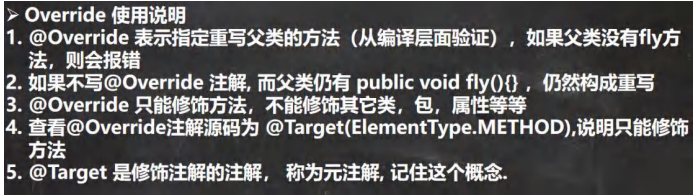
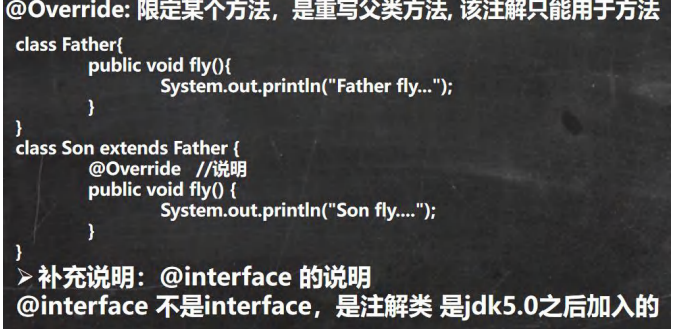
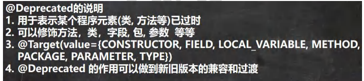
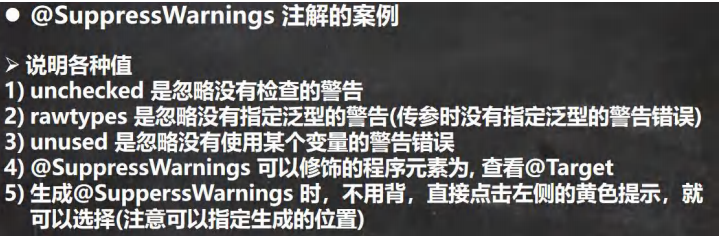

# 一、自定义类实现枚举

## （一）基本介绍


```java
public class Enumeration02 {
public static void main(String[] args) {
System.out.println(Season.AUTUMN);
System.out.println(Season.SPRING);
}
}
//演示字定义枚举实现
class Season {//类
private String name;
private String desc;//描述
//定义了四个对象, 固定. 
public static final Season SPRING = new Season("春天", "温暖");
public static final Season WINTER = new Season("冬天", "寒冷");
public static final Season AUTUMN = new Season("秋天", "凉爽");
public static final Season SUMMER = new Season("夏天", "炎热");
//1. 将构造器私有化,目的防止 直接 new
//2. 去掉 setXxx 方法, 防止属性被修改
//3. 在 Season 内部，直接创建固定的对象
//4. 优化，可以加入 final 修饰符
private Season(String name, String desc) {
this.name = name;
this.desc = desc;
}
public String getName() {
return name;
}
public String getDesc() {
return desc;
}
@Override
public String toString() {
return "Season{" +
"name='" + name + '\'' +
", desc='" + desc + '\'' +
'}';
}
}
```

自定义类实现枚举有如下特点：

- 构造器私有化
- 本类内部创建一组对象[四个 春夏秋冬]
- 对外暴露对象（通过为对象添加 public final static 修饰符）
- 可以提供 get 方法，但是不要提供 set

# 二、enum关键字实现枚举

## （一）快速入门

```java
//定义了四个对象, 固定. // public static final Season SPRING = new Season("春天", "温暖");
// public static final Season WINTER = new Season("冬天", "寒冷");
// public static final Season AUTUMN = new Season("秋天", "凉爽");
// public static final Season SUMMER = new Season("夏天", "炎热");
//如果使用了 enum 来实现枚举类
//1. 使用关键字 enum 替代 class
//2. public static final Season SPRING = new Season("春天", "温暖") 直接使用
// SPRING("春天", "温暖") 解读 常量名(实参列表)
//3. 如果有多个常量(对象)， 使用 ,号间隔即可
//4. 如果使用 enum 来实现枚举，要求将定义常量对象，写在前面
//5. 如果我们使用的是无参构造器，创建常量对象，则可以省略 ()
enum Season2{
SPRING("春天", "温暖"), WINTER("冬天", "寒冷"), AUTUMN("秋天", "凉爽"), SUMMER("夏天", "炎热")/*, What()*/;
private String name;
private String desc;//描述
private Season2() {//无参构造器，由what（）调用
}
private Season2(String name, String desc) {
this.name = name;
this.desc = desc;
}
public String getName() {
return name;
}
public String getDesc() {
return desc;
}
@Override
public String toString() {
return "Season{" +
"name='" + name + '\'' +
", desc='" + desc + '\'' +
'}';
}
}
}
```

## （二）注意事项

\1) 当我们使用 enum 关键字开发一个枚举类时，默认会继承 Enum 类, 而且是一个 final 类[如何证明],老师使用 javap 工

具来演示

\2) 传统的 public static final Season2 SPRING = new Season2("春天", "温暖"); 简化成 SPRING("春天", "温暖")， 这里必

须知道，它调用的是哪个构造器. 

\3) 如果使用无参构造器 创建 枚举对象，则实参列表和小括号都可以省略

\4) 当有多个枚举对象时，使用,间隔，最后有一个分号结尾

\5) 枚举对象必须放在枚举类的行首

## （三）enum的成员方法


```java
public class EnumMethod {
public static void main(String[] args) {
//使用 Season2 枚举类，来演示各种方法
Season2 autumn = Season2.AUTUMN;
//输出枚举对象的名字
System.out.println(autumn.name());
//ordinal() 输出的是该枚举对象的次序/编号，从 0 开始编号
//AUTUMN 枚举对象是第三个，因此输出 2
System.out.println(autumn.ordinal());
//从反编译可以看出 values 方法，返回 Season2[]
//含有定义的所有枚举对象
Season2[] values = Season2.values();
System.out.println("===遍历取出枚举对象(增强 for)====");
for (Season2 season: values) {//增强 for 循环
System.out.println(season);
}
//valueOf：将字符串转换成枚举对象，要求字符串必须
为已有的常量名，否则报异常
//执行流程
//1. 根据你输入的 "AUTUMN" 到 Season2 的枚举对象去查找
//2. 如果找到了，就返回，如果没有找到，就报错
Season2 autumn1 = Season2.valueOf("AUTUMN");
System.out.println("autumn1=" + autumn1);
System.out.println(autumn == autumn1);
//compareTo：比较两个枚举常量，比较的就是编号
//老韩解读
//1. 就是把 Season2.AUTUMN 枚举对象的编号 和 Season2.SUMMER 枚举对象的编号比较
//2. 看看结果
/* 
public final int compareTo(E o) {

return self.ordinal - other.ordinal;
}
Season2.AUTUMN 的编号[2] - Season2.SUMMER 的编号[3]
*/
System.out.println(Season2.AUTUMN.compareTo(Season2.SUMMER));
//补充了一个增强 for
 int[] nums = {1, 2, 9};
// //普通的 for 循环
System.out.println("=====普通的 for=====");
 for (int i = 0; i < nums.length; i++) {
 System.out.println(nums[i]);
 }
 System.out.println("=====增强的 for=====");
// //执行流程是 依次从 nums 数组中取出数据，赋给 i, 如果取出完毕，则退出 for,迭代器直接获取元素并且顺序输出，普通的fori是通过索引获取元素再输出
 for(int i : nums) {
 System.out.println("i=" + i);
 }
}
}
```

## （四）实现接口


```java
public class EnumDetail {
public static void main(String[] args) {
Music.CLASSICMUSIC.playing();
}
}
class A {
}
//1.使用 enum 关键字后，就不能再继承其它类了，因为 enum 会隐式继承 Enum，而 Java 是单继承机制
//enum Season3 extends A {
//
//}
//2.enum 实现的枚举类，仍然是一个类，所以还是可以实现接口的. interface IPlaying {
public void playing();
}
enum Music implements IPlaying {
CLASSICMUSIC;
@Override
public void playing() {
System.out.println("播放好听的音乐...");
} 
}
```

# 三、注解(Annotation)

## （一）基本介绍

\1) 注解(Annotation)也被称为元数据(Metadata)，用于修饰解释 包、类、方法、属性、构造器、局部变量等数据信息。

\2) 和注释一样，注解不影响程序逻辑，但注解可以被编译或运行，相当于嵌入在代码中的补充信息。

\3) 在 JavaSE 中，注解的使用目的比较简单，例如标记过时的功能，忽略警告等。在 JavaEE 中注解占据了更重要的角

色，例如用来配置应用程序的任何切面，代替 java EE 旧版中所遗留的繁冗代码和 XML 配置等。


使用 Annotation 时要在其前面增加 @ 符号, 并把该 Annotation 当成一个修饰符使用。用于修饰它支持的程序元

素

三个基本的 Annotation:

\1) @Override: 限定某个方法，是重写父类方法, 该注解只能用于方法

\2) @Deprecated: 用于表示某个程序元素(类, 方法等)已过时

\3) @SuppressWarnings: 抑制编译器警告

### 1、Override注解详解






### 2、@Deprecated 注解

```java
public class Deprecated_ {
public static void main(String[] args) {
A a = new A();
a.hi();
System.out.println(a.n1);
}
}
//老韩解读
//1. @Deprecated 修饰某个元素, 表示该元素已经过时
//2. 即不在推荐使用，但是仍然可以使用
//3. 查看 @Deprecated 注解类的源码
//4. 可以修饰方法，类，字段, 包, 参数 等等
//5. @Deprecated 可以做版本升级过渡使用
/*
@Documented
@Retention(RetentionPolicy.RUNTIME)
@Target(value={CONSTRUCTOR, FIELD, LOCAL_VARIABLE, METHOD, PACKAGE, PARAMETER, TYPE})
public @interface Deprecated {
}
*/
@Deprecated
class A {
@Deprecated
public int n1 = 10;
@Deprecated
public void hi(){
}
}
```



### 3 、@SuppressWarnings 注解

```java
@SuppressWarnings({"rawtypes", "unchecked", "unused"})
public class SuppressWarnings_ {
//老韩解读
//1. 当我们不希望看到这些警告的时候，可以使用 SuppressWarnings 注解来抑制警告信息
//2. 在{""} 中，可以写入你希望抑制(不显示)警告信息
//3. 可以指定的警告类型有
// all，抑制所有警告
// boxing，抑制与封装/拆装作业相关的警告
// //cast，抑制与强制转型作业相关的警告
// //dep-ann，抑制与淘汰注释相关的警告
// //deprecation，抑制与淘汰的相关警告
// //fallthrough，抑制与 switch 陈述式中遗漏 break 相关的警告
// //finally，抑制与未传回 finally 区块相关的警告
// //hiding，抑制与隐藏变数的区域变数相关的警告
// //incomplete-switch，抑制与 switch 陈述式(enum case)中遗漏项目相关的警告
// //javadoc，抑制与 javadoc 相关的警告
// //nls，抑制与非 nls 字串文字相关的警告
// //null，抑制与空值分析相关的警告
// //rawtypes，抑制与使用 raw 类型相关的警告
// //resource，抑制与使用 Closeable 类型的资源相关的警告
// //restriction，抑制与使用不建议或禁止参照相关的警告
// //serial，抑制与可序列化的类别遗漏 serialVersionUID 栏位相关的警告
// //static-access，抑制与静态存取不正确相关的警告
// //static-method，抑制与可能宣告为 static 的方法相关的警告
// //super，抑制与置换方法相关但不含 super 呼叫的警告
// //synthetic-access，抑制与内部类别的存取未最佳化相关的警告
// //sync-override，抑制因为置换同步方法而遗漏同步化的警告
// //unchecked，抑制与未检查的作业相关的警告
// //unqualified-field-access，抑制与栏位存取不合格相关的警告
// //unused，抑制与未用的程式码及停用的程式码相关的警告
//4. 关于 SuppressWarnings 作用范围是和你放置的位置相关
// 比如 @SuppressWarnings 放置在 main 方法，那么抑制警告的范围就是 main
// 通常我们可以放置具体的语句, 方法, 类. //5. 看看 @SuppressWarnings 源码
//(1) 放置的位置就是 TYPE, FIELD, METHOD, PARAMETER, CONSTRUCTOR, LOCAL_VARIABLE
//(2) 该注解类有数组 String[] values() 设置一个数组比如 {"rawtypes", "unchecked", "unused"}
/*
@Target({TYPE, FIELD, METHOD, PARAMETER, CONSTRUCTOR, LOCAL_VARIABLE})
@Retention(RetentionPolicy.SOURCE)
public @interface SuppressWarnings {
String[] value();
}
*/
public static void main(String[] args) {
List list = new ArrayList();
list.add("jack");
list.add("tom");
list.add("mary");
int i;
System.out.println(list.get(1));
}
public void f1() {
// @SuppressWarnings({"rawtypes"})
List list = new ArrayList();
list.add("jack");
list.add("tom");
list.add("mary");
// @SuppressWarnings({"unused"})
int i;
System.out.println(list.get(1));
}
}
```




## （二）元注解

