# 一、线程

## （一）相关概念

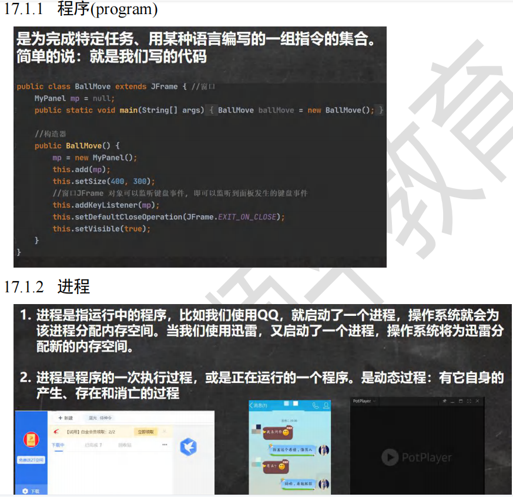


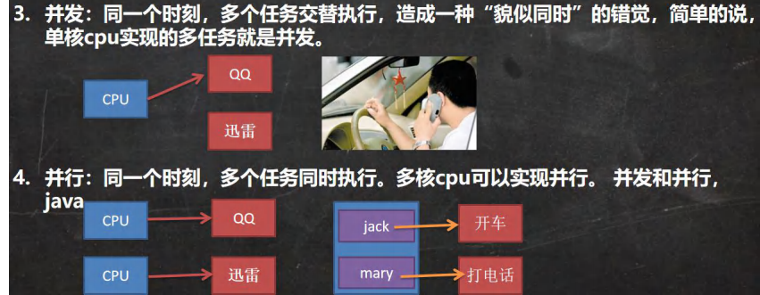

## （二）创建线程的两种方式

### 1、基本使用

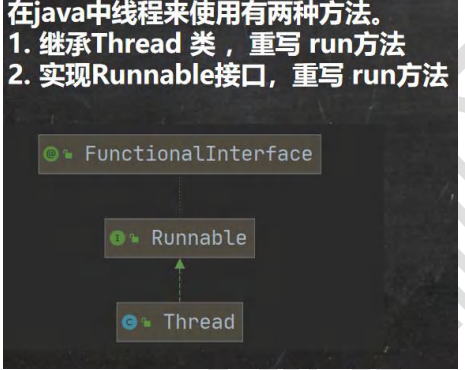


### 2、案例介绍

#### 案例一 继承 Thread 类

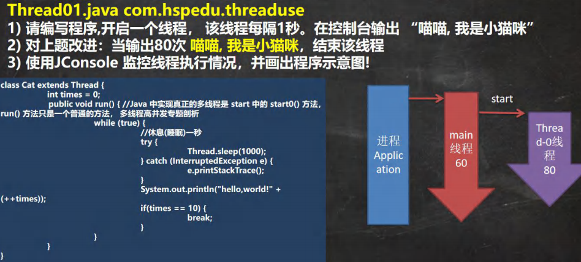

```java
public class Thread01 {
public static void main(String[] args) throws InterruptedException {
//创建 Cat 对象，可以当做线程使用
Cat cat = new Cat();
//老韩读源码
/*
(1)
public synchronized void start() {
start0();
}
(2)
//start0() 是本地方法，是 JVM 调用, 底层是 c/c++实现
//真正实现多线程的效果， 是 start0(), 而不是 run
private native void start0();
*/
cat.start();//启动线程-> 最终会执行 cat 的 run 方法
//cat.run();//run 方法就是一个普通的方法, 没有真正的启动一个线程，就会把 run 方法执行完毕，才向下执行,是由主线程所调用的方法
//说明: 当 main 线程启动一个子线程 Thread-0, 主线程不会阻塞, 会继续执行
//这时 主线程和子线程是交替执行.. System.out.println("主线程继续执行" + Thread.currentThread().getName());//名字 main
for(int i = 0; i < 60; i++) {
System.out.println("主线程 i=" + i);
//让主线程休眠
Thread.sleep(1000);
}
}
}
//老韩说明
//1. 当一个类继承了 Thread 类， 该类就可以当做线程使用
//2. 我们会重写 run 方法，写上自己的业务代码
//3. run Thread 类 实现了 Runnable 接口的 run 方法
/*
@Override
public void run() {
if (target != null) {
target.run();
}
}
*/
class Cat extends Thread {
int times = 0;
@Override
public void run() {//重写 run 方法，写上自己的业务逻辑
while (true) {
//该线程每隔 1 秒。在控制台输出 “喵喵, 我是小猫咪”
System.out.println("喵喵, 我是小猫咪" + (++times) + " 线程名=" + Thread.currentThread().getName());
//让该线程休眠 1 秒 ctrl+alt+t
try {
Thread.sleep(1000);//按毫秒
} catch (InterruptedException e) {
e.printStackTrace();
}
if(times == 80) {
break;//当 times 到 80, 退出 while, 这时线程也就退出.. }
}
}
}
```

#### 案例二  实现 Runnable 接口

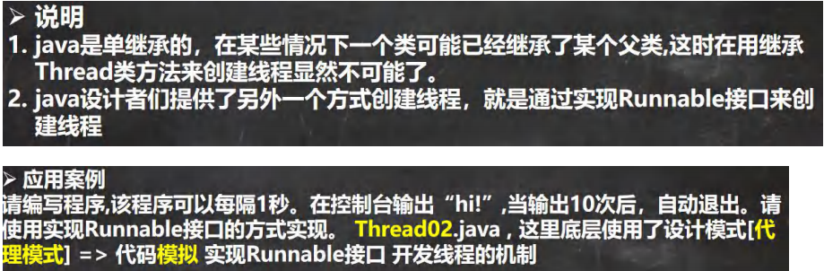

```java
public class Thread02 {
public static void main(String[] args) {
Dog dog = new Dog();
//dog.start(); 这里不能调用 start
//创建了 Thread 对象，把 dog 对象(实现 Runnable),放入 Thread
Thread thread = new Thread(dog);
thread.start();
// Tiger tiger = new Tiger();//实现了 Runnable
// ThreadProxy threadProxy = new ThreadProxy(tiger);
// threadProxy.start();
}
}
class Animal {
}
class Tiger extends Animal implements Runnable {
@Override
public void run() {
System.out.println("老虎嗷嗷叫....");
}
}
//线程代理类 , 模拟了一个极简的 Thread 类
class ThreadProxy implements Runnable {//你可以把 Proxy 类当做 ThreadProxy
private Runnable target = null;//属性，类型是 Runnable，接口不能实例化，但是可以指向实现了接口的类的对象
@Override
public void run() {
if (target != null) {
target.run();//动态绑定（运行类型 Tiger）
}
}
public ThreadProxy(Runnable target) {
this.target = target;
}
public void start() {
start0();//这个方法时真正实现多线程方法
}
public void start0() {
run();
}
}
class Dog implements Runnable { //通过实现 Runnable 接口，开发线程
int count = 0;
@Override
public void run() { //普通方法
while (true) {
System.out.println("小狗汪汪叫..hi" + (++count) + Thread.currentThread().getName());
//休眠 1 秒
try {
Thread.sleep(1000);
} catch (InterruptedException e) {
e.printStackTrace();
}
if (count == 10) {
break;
}
}
}
}
```

#### 案例三 多线程执行


```java
public class Thread03 {
public static void main(String[] args) {
T1 t1 = new T1();
T2 t2 = new T2();
Thread thread1 = new Thread(t1);
Thread thread2 = new Thread(t2);
thread1.start();//启动第 1 个线程
thread2.start();//启动第 2 个线程
//... }
}
class T1 implements Runnable {
int count = 0;
@Override
public void run() {
while (true) {
//每隔 1 秒输出 “hello,world”,输出 10 次
System.out.println("hello,world " + (++count));
try {
Thread.sleep(1000);
} catch (InterruptedException e) {
e.printStackTrace();
}
if(count == 60) {
break;
}
}
}
}
class T2 implements Runnable {
int count = 0;
@Override
public void run() {
//每隔 1 秒输出 “hi”,输出 5 次
while (true) {
System.out.println("hi " + (++count));
try {
Thread.sleep(1000);
} catch (InterruptedException e) {
e.printStackTrace();
}
if(count == 50) {
break;
}
}
}
}
```

### 3、线程的理解

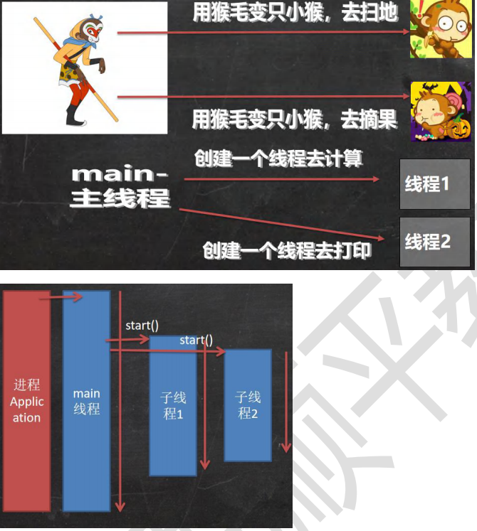

### 4、继承 Thread vs 实现 Runnable 的区别

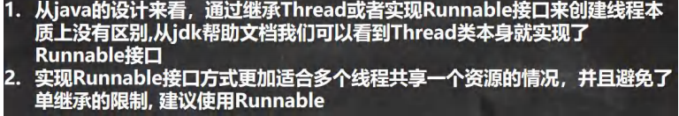

售票问题，有三个窗口，同时卖一百张票

```java
public class SellTicket {
public static void main(String[] args) {
//测试
// SellTicket01 sellTicket01 = new SellTicket01();
// SellTicket01 sellTicket02 = new SellTicket01();
// SellTicket01 sellTicket03 = new SellTicket01();
//
// //这里我们会出现超卖.. // sellTicket01.start();//启动售票线程
// sellTicket02.start();//启动售票线程
// sellTicket03.start();//启动售票线程
System.out.println("===使用实现接口方式来售票=====");
SellTicket02 sellTicket02 = new SellTicket02();
new Thread(sellTicket02).start();//第 1 个线程-窗口
new Thread(sellTicket02).start();//第 2 个线程-窗口
new Thread(sellTicket02).start();//第 3 个线程-窗口
}
}
//使用 Thread 方式
class SellTicket01 extends Thread {
private static int ticketNum = 100;//让多个线程共享 ticketNum
@Override
public void run() {
while (true) {
if (ticketNum <= 0) {
System.out.println("售票结束...");
break;
}
//休眠 50 毫秒, 模拟
try {
Thread.sleep(50);
} catch (InterruptedException e) {
e.printStackTrace();
}
System.out.println("窗口 " + Thread.currentThread().getName() + " 售出一张票" + " 剩余票数=" + (--ticketNum));
}
}
}
//实现接口方式
class SellTicket02 implements Runnable {
private int ticketNum = 100;//让多个线程共享 ticketNum
@Override
public void run() {
while (true) {
if (ticketNum <= 0) {
System.out.println("售票结束...");
break;
}
//休眠 50 毫秒, 模拟
try {
Thread.sleep(50);
} catch (InterruptedException e) {
e.printStackTrace();
}
System.out.println("窗口 " + Thread.currentThread().getName() + " 售出一张票" + " 剩余票数=" + (--ticketNum));//1 - 0 - -1 - -2
}
}
}
```

# 二、线程的终止

## （一）基本说明


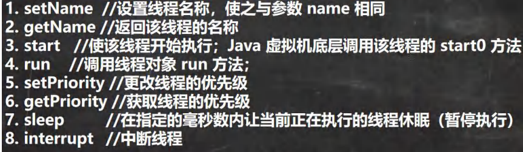

## （二）线程注意事项

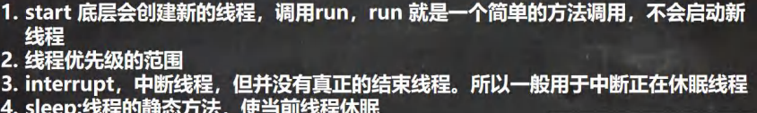

常用方法2

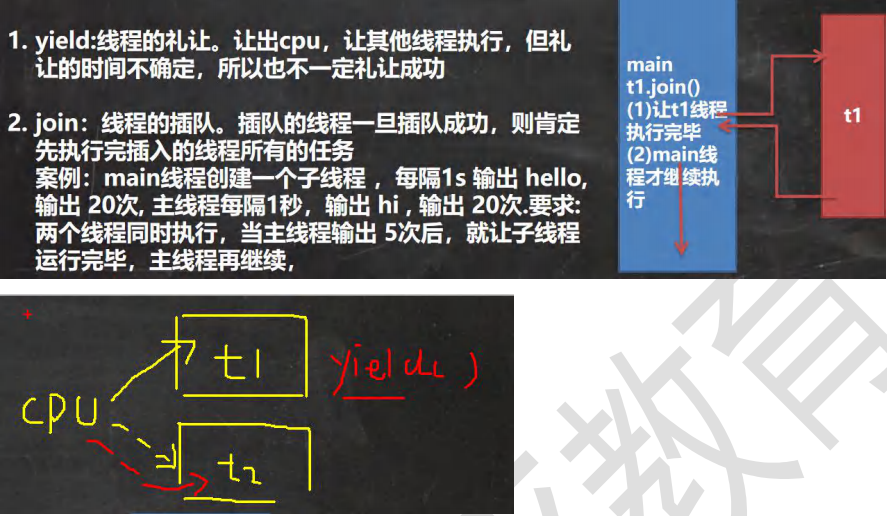

- yield告诉cpu先别执行t1，主动放弃让t2先执行，但是也不一定礼让成功，原因是cpu此时被占用的资源并不是很紧张，CPU来回切换既可以照顾t2也可以照顾t1，所以不一定成功，在资源紧张的时候成功率更大
- 

## （三）用户线程和守护线程


### 1、案例

将一个线程设置成守护线程

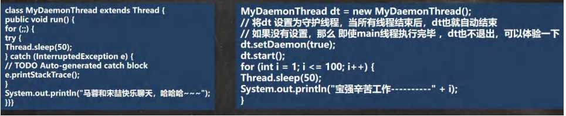

# 三、线程的生命周期

## （一）基本介绍

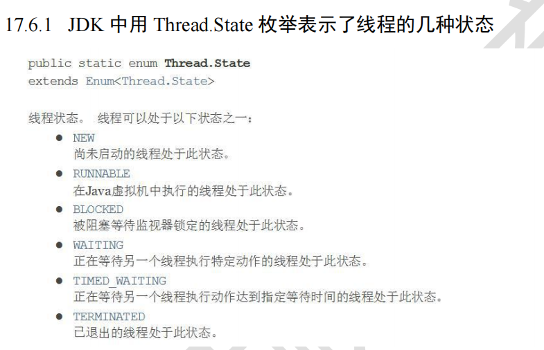

## （二）线程转换图

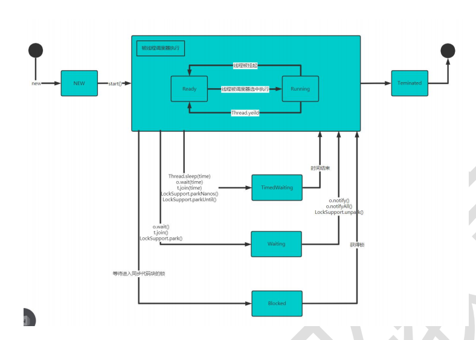

# 四、线程的同步

## （一）基本介绍

售票问题，有三个窗口，同时卖一百张票，当只剩最后一张或者两张时，由于三个窗口（进程）会同时访问这一张或者两张票。导致结果出现-1或者-2张票，为了避免这种状况，由此引出线程的同步

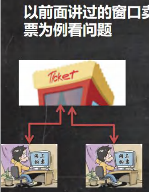

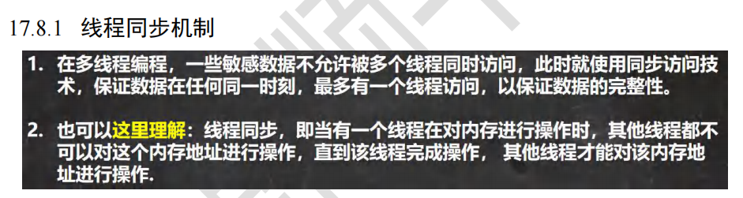

## （二）同步具体方法-Synchronized

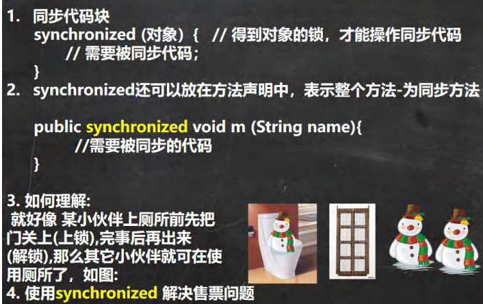

## （三）同步原理

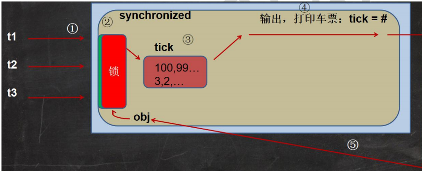

- t1 t2 t3争夺这把锁，而这个锁是放在对象上的，也叫互斥锁
- t1拿掉这把锁，然后进行操作，做完一系列操作之后放回这把锁
- t1、t2、t3去争夺这把锁，因为是非公平锁

# 五、互斥锁

## （一）基本介绍

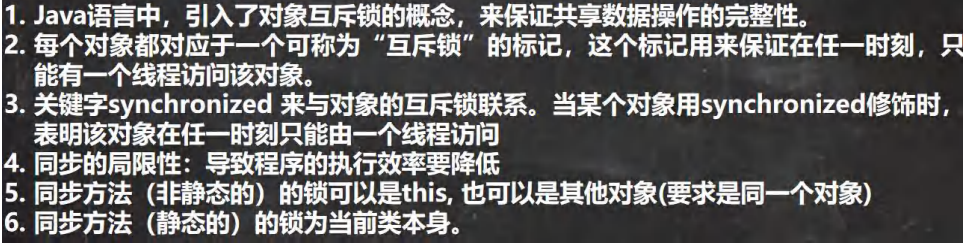

## （二）使用互斥锁来解决售票问题

```java
public class SellTicket {
public static void main(String[] args) {
//测试
// SellTicket01 sellTicket01 = new SellTicket01();
// SellTicket01 sellTicket02 = new SellTicket01();
// SellTicket01 sellTicket03 = new SellTicket01();
//
// //这里我们会出现超卖.. // sellTicket01.start();//启动售票线程
// sellTicket02.start();//启动售票线程
// sellTicket03.start();//启动售票线程
// System.out.println("===使用实现接口方式来售票=====");
// SellTicket02 sellTicket02 = new SellTicket02();
//
// new Thread(sellTicket02).start();//第 1 个线程-窗口
// new Thread(sellTicket02).start();//第 2 个线程-窗口
// new Thread(sellTicket02).start();//第 3 个线程-窗口
//测试一把
SellTicket03 sellTicket03 = new SellTicket03();
new Thread(sellTicket03).start();//第 1 个线程-窗口
new Thread(sellTicket03).start();//第 2 个线程-窗口
new Thread(sellTicket03).start();//第 3 个线程-窗口
}
}
//实现接口方式, 使用 synchronized 实现线程同步
class SellTicket03 implements Runnable {
private int ticketNum = 100;//让多个线程共享 ticketNum
private boolean loop = true;//控制 run 方法变量
Object object = new Object();
//同步方法（静态的）的锁为当前类本身
//老韩解读
//1. public synchronized static void m1() {} 锁是加在 SellTicket03.class
//2. 如果在静态方法中，实现一个同步代码块. /*
synchronized (SellTicket03.class) {
System.out.println("m2");
}
*/
public synchronized static void m1() {
}
public static void m2() {
synchronized (SellTicket03.class) {
System.out.println("m2");
}
}
//老韩说明
//1. public synchronized void sell() {} 就是一个同步方法
//2. 这时锁在 this 对象
//3. 也可以在代码块上写 synchronize ,同步代码块, 互斥锁还是在 this 对象
public /*synchronized*/ void sell() { //同步方法, 在同一时刻， 只能有一个线程来执行 sell 方法
synchronized (/*this*/ object) {
if (ticketNum <= 0) {
System.out.println("售票结束...");
loop = false;
return;
}
//休眠 50 毫秒, 模拟
try {
Thread.sleep(50);
} catch (InterruptedException e) {
e.printStackTrace();
}
System.out.println("窗口 " + Thread.currentThread().getName() + " 售出一张票" + " 剩余票数=" + (--ticketNum));//1 - 0 - -1 - -2
}
}
@Override
public void run() {
while (loop) {
sell();//sell 方法是一共同步方法
}
}
}
//使用 Thread 方式
// new SellTicket01().start()
// new SellTicket01().start();
class SellTicket01 extends Thread {
private static int ticketNum = 100;//让多个线程共享 ticketNum
// public void m1() {
// synchronized (this) {
// System.out.println("hello");
// }
// }
@Override
public void run() {
while (true) {
if (ticketNum <= 0) {
System.out.println("售票结束...");
break;
}
韩顺平循序渐进学 Java 零基础
//休眠 50 毫秒, 模拟
try {
Thread.sleep(50);
} catch (InterruptedException e) {
e.printStackTrace();
}
System.out.println("窗口 " + Thread.currentThread().getName() + " 售出一张票" + " 剩余票数=" + (--ticketNum));
}
}
}
//实现接口方式
class SellTicket02 implements Runnable {
private int ticketNum = 100;//让多个线程共享 ticketNum
@Override
public void run() {
while (true) {
if (ticketNum <= 0) {
System.out.println("售票结束...");
break;
}
//休眠 50 毫秒, 模拟
try {
Thread.sleep(50);
} catch (InterruptedException e) {
e.printStackTrace();
}
System.out.println("窗口 " + Thread.currentThread().getName() + " 售出一张票" + " 剩余票数=" + (--ticketNum));//1 - 0 - -1 - -2
}
}
}
```

## （三）注意事项和使用细节

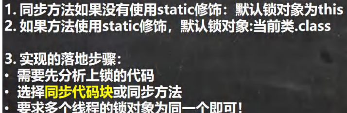

# 六、线程的死锁

## （一）基本介绍


## （二）应用案例


```java
public class DeadLock_ {
public static void main(String[] args) {
//模拟死锁现象
DeadLockDemo A = new DeadLockDemo(true);
A.setName("A 线程");
DeadLockDemo B = new DeadLockDemo(false);
B.setName("B 线程");
A.start();
B.start();
}
}
//线程
class DeadLockDemo extends Thread {
static Object o1 = new Object();// 保证多线程，共享一个对象,这里使用 static
static Object o2 = new Object();
boolean flag;
public DeadLockDemo(boolean flag) {//构造器
this.flag = flag;
}
@Override
public void run() {
//下面业务逻辑的分析
//1. 如果 flag 为 T, 线程 A 就会先得到/持有 o1 对象锁, 然后尝试去获取 o2 对象锁
//2. 如果线程 A 得不到 o2 对象锁，就会 Blocked
//3. 如果 flag 为 F, 线程 B 就会先得到/持有 o2 对象锁, 然后尝试去获取 o1 对象锁
//4. 如果线程 B 得不到 o1 对象锁，就会 Blocked
if (flag) {
synchronized (o1) {//对象互斥锁, 下面就是同步代码
System.out.println(Thread.currentThread().getName() + " 进入 1");
synchronized (o2) { // 这里获得 li 对象的监视权
System.out.println(Thread.currentThread().getName() + " 进入 2");
}
}
} else {
synchronized (o2) {
System.out.println(Thread.currentThread().getName() + " 进入 3");
synchronized (o1) { // 这里获得 li 对象的监视权
System.out.println(Thread.currentThread().getName() + " 进入 4");
}
}
}
}
}
```

# 七、释放锁

## （一）基本介绍

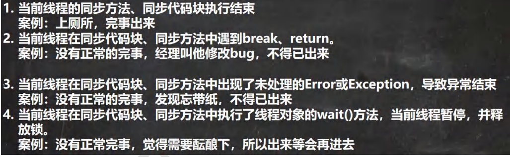

## （二）下面操作不会释放锁

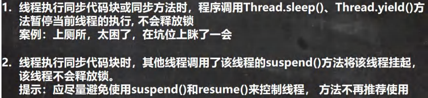

