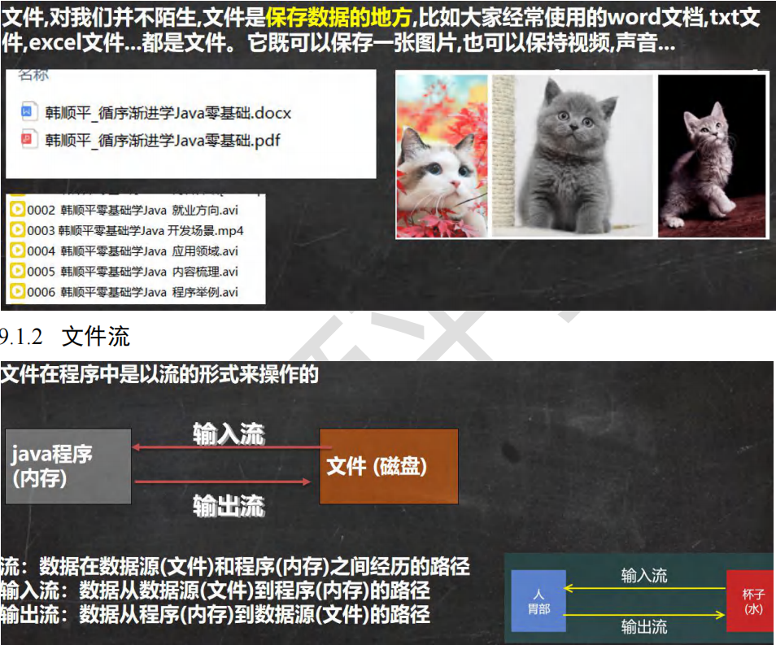
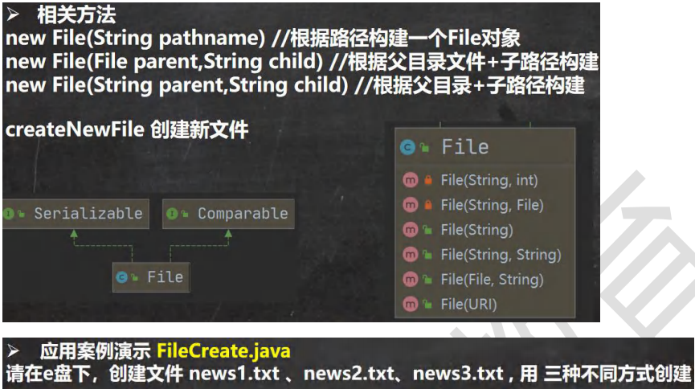
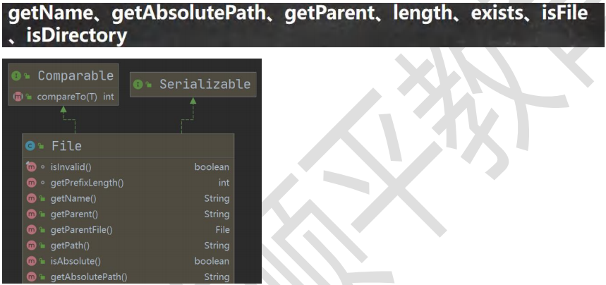
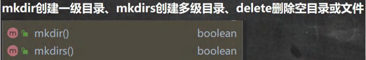

# 一、文件

## （一）基本介绍



## （二）常用的文件操作



```java
public class FileCreate {
public static void main(String[] args) {
}
//方式 1 new File(String pathname)
@Test
public void create01() {
String filePath = "e:\\news1.txt";
File file = new File(filePath);
try {
file.createNewFile();
System.out.println("文件创建成功");
} catch (IOException e) {
e.printStackTrace();
}
}
//方式 2 new File(File parent,String child) //根据父目录文件+子路径构建
//e:\\news2.txt
@Test
public void create02() {
File parentFile = new File("e:\\");//两个斜杆是因为有一个是转义字符
String fileName = "news2.txt";
//这里的 file 对象，在 java 程序中，只是一个对象
//只有执行了 createNewFile 方法，才会真正的，在磁盘创建该文件
File file = new File(parentFile, fileName);
try {
file.createNewFile();
System.out.println("创建成功~");
} catch (IOException e) {
e.printStackTrace();
}
}
//方式 3 new File(String parent,String child) //根据父目录+子路径构建
@Test
public void create03() {
//String parentPath = "e:\\";
String parentPath = "e:\\";
String fileName = "news4.txt";
File file = new File(parentPath, fileName);
try {
file.createNewFile();
System.out.println("创建成功~");
} catch (IOException e) {
e.printStackTrace();
}
}
//下面四个都是抽象类
//
//InputStream
//OutputStream
//Reader //字符输入流
//Writer //字符输出流
}
```

## （三）获取文件的相关信息



```java
public class FileInformation {
public static void main(String[] args) {
}
//获取文件的信息
@Test
public void info() {
//先创建文件对象
File file = new File("e:\\news1.txt");
//调用相应的方法，得到对应信息
System.out.println("文件名字=" + file.getName());
//getName、getAbsolutePath、getParent、length、exists、isFile、isDirectory
System.out.println("文件绝对路径=" + file.getAbsolutePath());
System.out.println("文件父级目录=" + file.getParent());
System.out.println("文件大小(字节)=" + file.length());
System.out.println("文件是否存在=" + file.exists());//T
System.out.println("是不是一个文件=" + file.isFile());//T
System.out.println("是不是一个目录=" + file.isDirectory());//F
}
}
```

## （四）目录的操作和文件删除



# 二、IO 流原理及流的分类

## （一）基本介绍


