# 	 一、类变量

## （一）基本介绍

```java
public class ChildGame {
public static void main(String[] args) {
//定义一个变量 count, 统计有多少小孩加入了游戏
int count = 0;
Child child1 = new Child("白骨精");
child1.join();
//count++;
child1.count++;
Child child2 = new Child("狐狸精");
child2.join();
//count++;
child2.count++;
Child child3 = new Child("老鼠精");
child3.join();
//count++;
child3.count++;
//===========
//类变量，可以通过类名来访问
System.out.println("共有" + Child.count + " 小孩加入了游戏...");
//下面的代码输出什么?
    System.out.println("child1.count=" + child1.count);//3
System.out.println("child2.count=" + child2.count);//3
System.out.println("child3.count=" + child3.count);//3
}
}
class Child { //类
private String name;
//定义一个变量 count ,是一个类变量(静态变量) static 静态
//该变量最大的特点就是会被 Child 类的所有的对象实例共享
public static int count = 0;
public Child(String name) {
this.name = name;
}
public void join() {
System.out.println(name + " 加入了游戏..");
}
}
```

- 类变量可以通过类名来访问

## （二）内存示意图

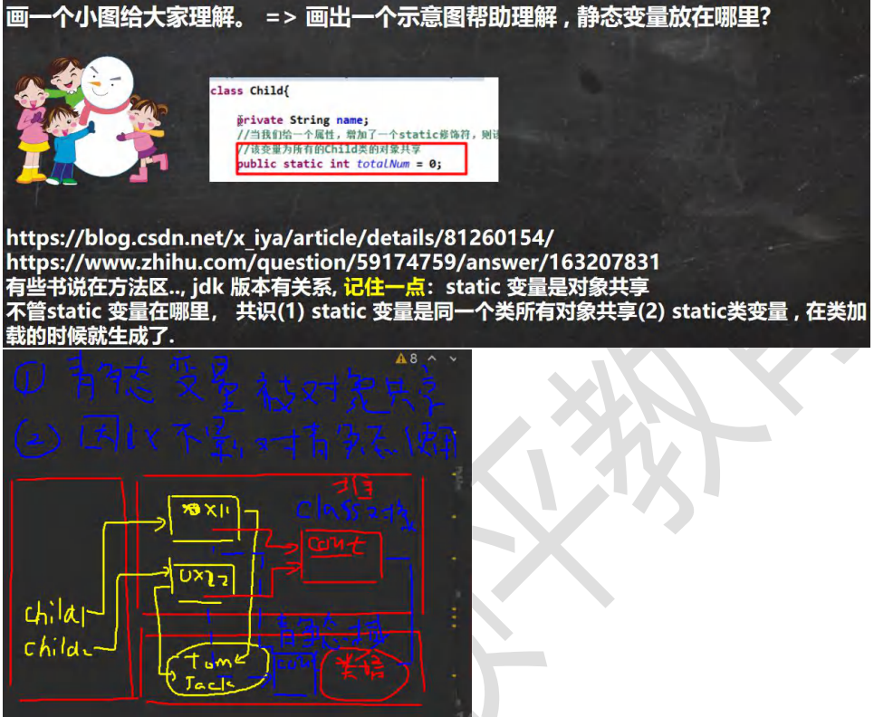

- class对象的含义：当类进行加载的时候，会在堆中生成一个对应的class对象，比如这个类是child类，child类就会在堆中生成一个child类的class对象，它是一个原型对象，你在创建每个对象的时候都要依照它来制造，而且通过这个对象能取到很多这个类的信息

## （三）类变量的定义、访问


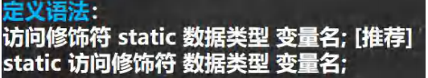


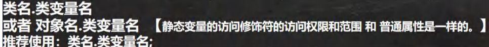

## （四）注意事项

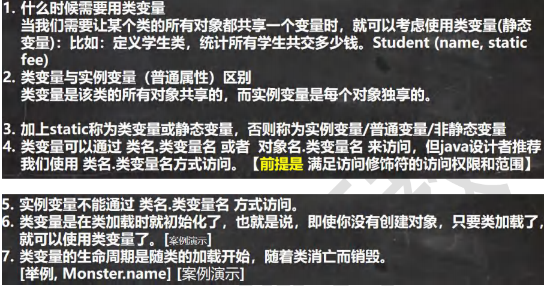

## （五）类方法的基本介绍

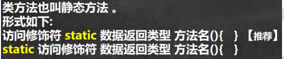


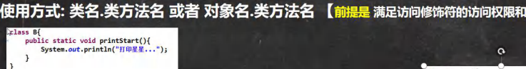

## （六）类方法的快速入门

```java
public class StaticMethod {
    public static void main(String[] args) {
//创建 2 个学生对象，叫学费
Stu tom = new Stu("tom");
//tom.payFee(100);
Stu.payFee(100);//对不对?对
Stu mary = new Stu("mary");
//mary.payFee(200);
Stu.payFee(200);//对
//输出当前收到的总学费
Stu.showFee();//300
//如果我们希望不创建实例，也可以调用某个方法(即当做工具来使用)
//这时，把方法做成静态方法时非常合适
System.out.println("9 开平方的结果是=" + Math.sqrt(9));
System.out.println(MyTools.calSum(10, 30));
}
}
//开发自己的工具类时，可以将方法做成静态的，方便调用
class MyTools {
//求出两个数的和
public static double calSum(double n1, double n2) {
    return n1 + n2;
}
//可以写出很多这样的工具方法... }
class Stu {
private String name;//普通成员
//定义一个静态变量，来累积学生的学费
private static double fee = 0;
public Stu(String name) {
this.name = name;
}
//说明
//1. 当方法使用了 static 修饰后，该方法就是静态方法
//2. 静态方法就可以访问静态属性/变量
public static void payFee(double fee) {
Stu.fee += fee;//累积到
}
public static void showFee() {
System.out.println("总学费有:" + Stu.fee);
}
}
```


## （七）类方法的使用场景

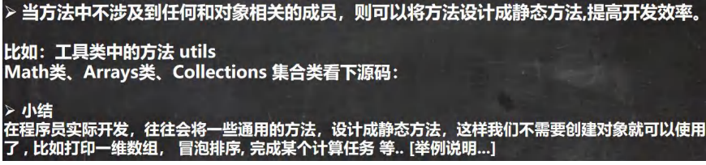

## （八）类方法的注意事项

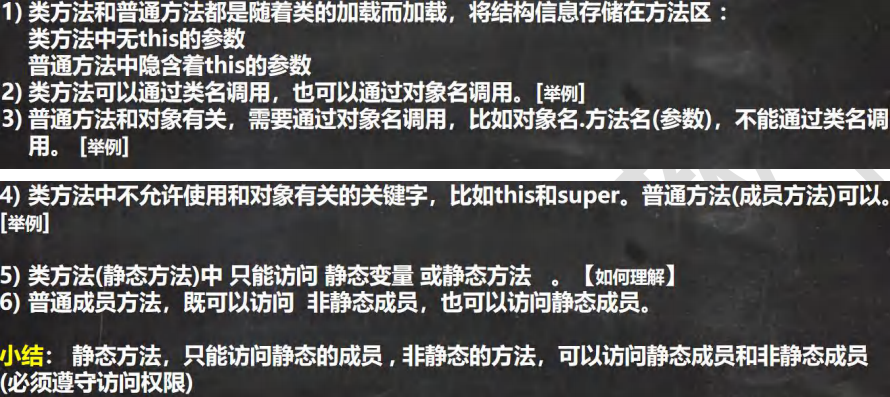

# 二、main方法语法

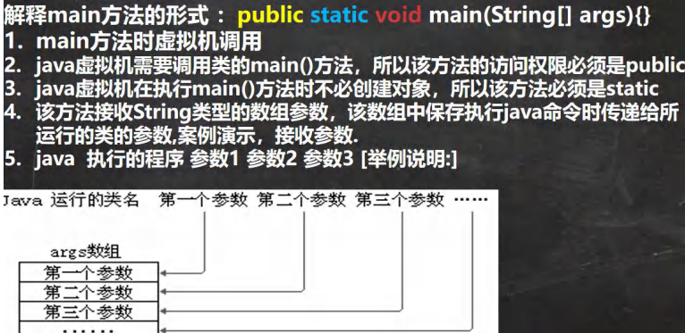

- 为什么格式的最开始要有public，因为虚拟机调用的时候跟它不在一个类，所以要用public

\1) 在 main()方法中，我们可以直接调用 main 方法所在类的静态方法或静态属性。

\2) 但是，不能直接访问该类中的非静态成员，必须创建该类的一个实例对象后，才能通过这个对象去访问类中的非静

态成员，

# 三、代码块

## （一）基本介绍

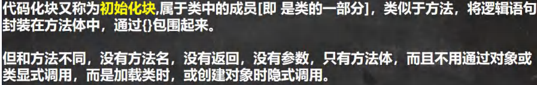


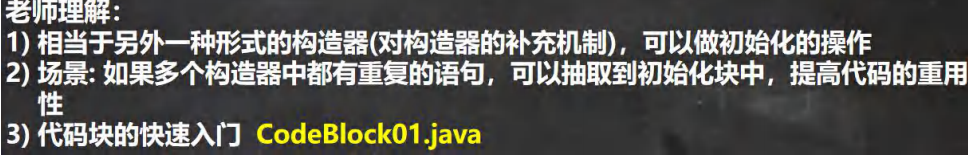

- 代码块调用的顺序优先于构造器

## （二）注意事项

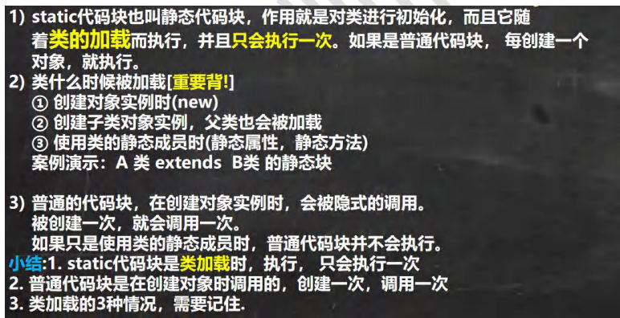


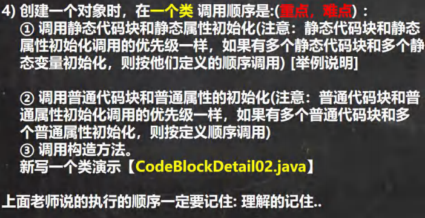

- 父静态、子静态、父普通、父构造、子普通、子构造

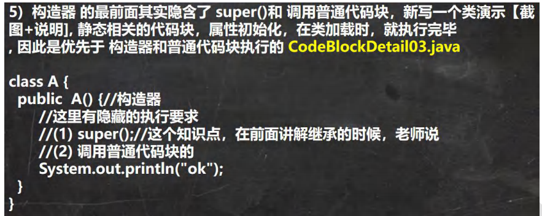


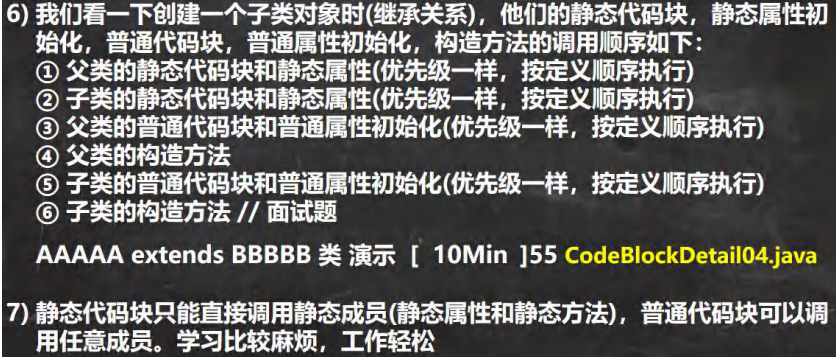

```java
public class CodeBlockDetail04 {
public static void main(String[] args) {
//老师说明
//(1) 进行类的加载
//1.1 先加载 父类 A02 1.2 再加载 B02
//(2) 创建对象
//2.1 从子类的构造器开始
//new B02();//对象
new C02();
}
}
class A02 { //父类
private static int n1 = getVal01();
static {
System.out.println("A02 的一个静态代码块..");//(2)
}
{
System.out.println("A02 的第一个普通代码块..");//(5)
}
public int n3 = getVal02();//普通属性的初始化
public static int getVal01() {
System.out.println("getVal01");//(1)
return 10;
}
    public int getVal02() {
System.out.println("getVal02");//(6)
return 10;
}
public A02() {//构造器
//隐藏
//super()
//普通代码和普通属性的初始化...... System.out.println("A02 的构造器");//(7)
}
}
class C02 {
private int n1 = 100;
private static int n2 = 200;
private void m1() {
}
private static void m2() {
}
    static {
//静态代码块，只能调用静态成员
//System.out.println(n1);错误
System.out.println(n2);//ok
//m1();//错误
m2();
}
{
//普通代码块，可以使用任意成员
System.out.println(n1);
System.out.println(n2);//ok
m1();
m2();
}
}
class B02 extends A02 { //
private static int n3 = getVal03();
static {
System.out.println("B02 的一个静态代码块..");//(4)
}
public int n5 = getVal04();
{
System.out.println("B02 的第一个普通代码块..");//(9)
    }
public static int getVal03() {
System.out.println("getVal03");//(3)
return 10;
}
public int getVal04() {
System.out.println("getVal04");//(8)
return 10;
}
//一定要慢慢的去品.. public B02() {//构造器
//隐藏了
//super()
//普通代码块和普通属性的初始化... System.out.println("B02 的构造器");//(10)
// TODO Auto-generated constructor stub
}
}
```


# 四、单例模式

## （一）基本介绍

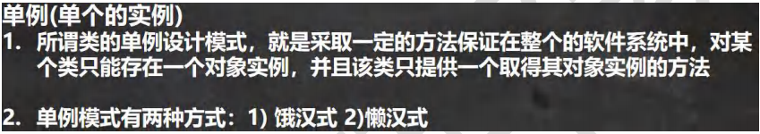


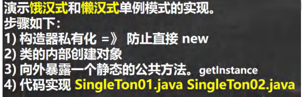

## （二）单例模式——饿汉式

  特点：还没有用到这个对象，可是这个类已经加载好了

```java
public class SingleTon01 {
    public static void main(String[] args) {
// GirlFriend xh = new GirlFriend("小红");
// GirlFriend xb = new GirlFriend("小白");
//通过方法可以获取对象
GirlFriend instance = GirlFriend.getInstance();
System.out.println(instance);
GirlFriend instance2 = GirlFriend.getInstance();
System.out.println(instance2);
System.out.println(instance == instance2);//T
//System.out.println(GirlFriend.n1);
//... }
}
//有一个类， GirlFriend
//只能有一个女朋友
class GirlFriend {
private String name;
    //public static int n1 = 100;
//为了能够在静态方法中，返回 gf 对象，需要将其修饰为 static
//對象，通常是重量級的對象, 餓漢式可能造成創建了對象，但是沒有使用.
    private static GirlFriend gf = new GirlFriend("小红红");
//如何保障我们只能创建一个 GirlFriend 对象
//步骤[单例模式-饿汉式]
//1. 将构造器私有化
//2. 在类的内部直接创建对象(该对象是 static)
//3. 提供一个公共的 static 方法，返回 gf 对象
private GirlFriend(String name) {
System.out.println("構造器被調用.");
this.name = name;
}
public static GirlFriend getInstance() {
return gf;
}
@Override
public String toString() {
return "GirlFriend{" +
"name='" + name + '\'' +
'}';
}
```


## （三）单例模式——懒汉式

特点：不去用它，它就不会创建

```java
/**
* 演示懶漢式的單例模式
*/
public class SingleTon02 {
public static void main(String[] args) {
//new Cat("大黃");
//System.out.println(Cat.n1);
Cat instance = Cat.getInstance();
System.out.println(instance);
//再次調用 getInstance
Cat instance2 = Cat.getInstance();
System.out.println(instance2);
System.out.println(instance == instance2);//T
}
}
//希望在程序運行過程中，只能創建一個 Cat 對象
//使用單例模式
class Cat {
private String name;
public static int n1 = 999;
private static Cat cat ; //默認是 null
//步驟
//1.仍然構造器私有化
//2.定義一個 static 靜態屬性對象
//3.提供一個 public 的 static 方法，可以返回一個 Cat 對象
//4.懶漢式，只有當用戶使用 getInstance 時，才返回 cat 對象, 後面再次調用時，會返回上次創建的 cat 對象
// 從而保證了單例
private Cat(String name) {
System.out.println("構造器調用...");
this.name = name;
}
public static Cat getInstance() {
if(cat == null) {//如果還沒有創建 cat 對象
cat = new Cat("小可愛");
}
return cat;
}
@Override
public String toString() {
    return "Cat{" +
"name='" + name + '\'' +
'}';
}
}
```

## （四）饿汉式和懒汉式的区别

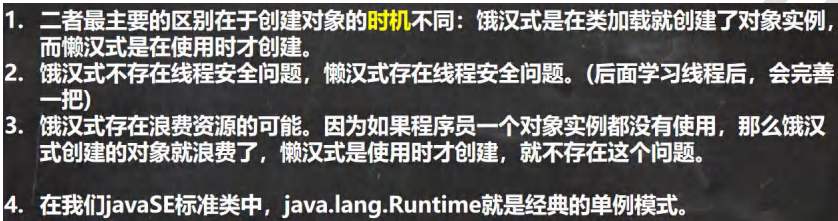

# 五、final关键字

## （一）基本介绍

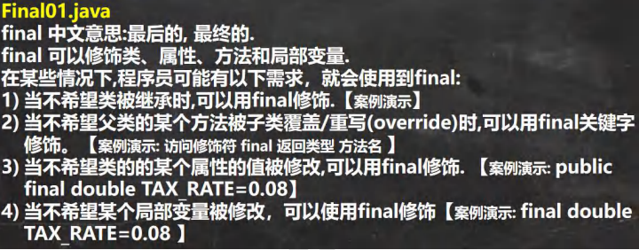

## （二）注意事项

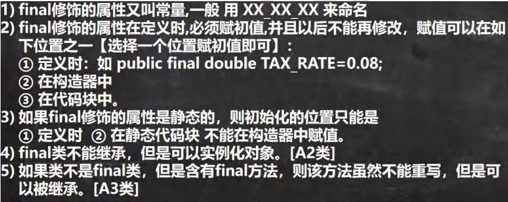


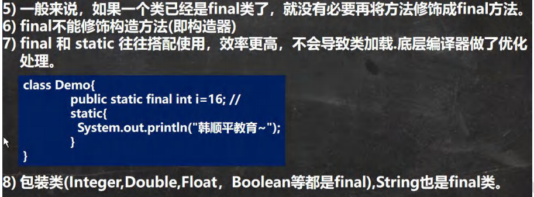

# 六、抽象类

## （一）基本介绍

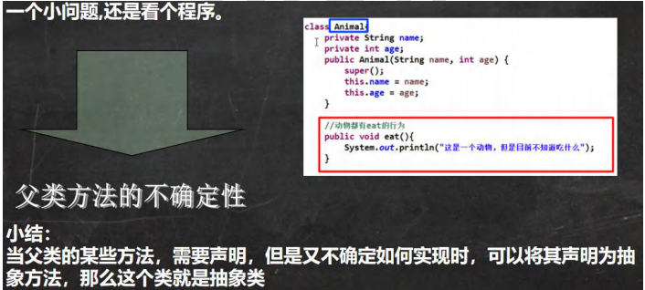

```java
package com.hspedu.abstract_;
public class Abstract01 {
public static void main(String[] args) {
}
}
abstract class Animal {
private String name;
public Animal(String name) {
this.name = name;
}
//思考：这里 eat 这里你实现了，其实没有什么意义
//即： 父类方法不确定性的问题
//===> 考虑将该方法设计为抽象(abstract)方法
//===> 所谓抽象方法就是没有实现的方法
//===> 所谓没有实现就是指，没有方法体
//===> 当一个类中存在抽象方法时，需要将该类声明为 abstract 类
//===> 一般来说，抽象类会被继承，有其子类来实现抽象方法. // public void eat() {
// System.out.println("这是一个动物，但是不知道吃什么..");
// }
    public abstract void eat() ;
}
```

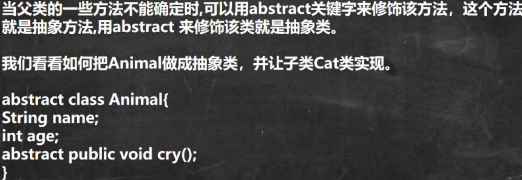


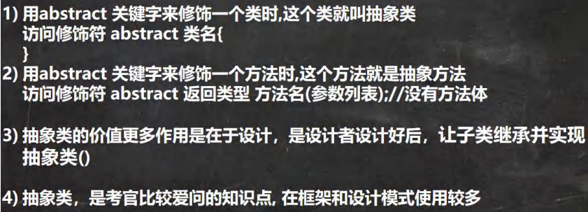

## （二）抽象类-模板设计模式

### 1、基本介绍


### 2、所能解决的问题

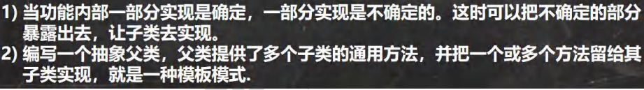

```java
abstract public class Template { //抽象类-模板设计模式
public abstract void job();//抽象方法
public void calculateTime() {//实现方法，调用 job 方法
//得到开始的时间
long start = System.currentTimeMillis();
    job(); //动态绑定机制
//得的结束的时间
long end = System.currentTimeMillis();
System.out.println("任务执行时间 " + (end - start));
}
}
package com.hspedu.abstract_;
public class AA extends Template {
//计算任务
//1+....+ 800000
@Override
public void job() { //实现 Template 的抽象方法 job
long num = 0;
for (long i = 1; i <= 800000; i++) {
num += i;
}
}
// public void job2() {
// //得到开始的时间
// long start = System.currentTimeMillis();
// long num = 0;
    // for (long i = 1; i <= 200000; i++) {
// num += i;
// }
// //得的结束的时间
// long end = System.currentTimeMillis();
// System.out.println("AA 执行时间 " + (end - start));
// }
}
package com.hspedu.abstract_;
public class BB extends Template{
public void job() {//这里也去，重写了 Template 的 job 方法
long num = 0;
for (long i = 1; i <= 80000; i++) {
num *= i;
}
}
}
package com.hspedu.abstract_;
public class TestTemplate {
public static void main(String[] args) {
    AA aa = new AA();
aa.calculateTime(); //这里还是需要有良好的 OOP 基础，对多态
BB bb = new BB();
bb.calculateTime();
}
}
```

## （三）注意事项


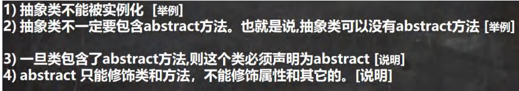


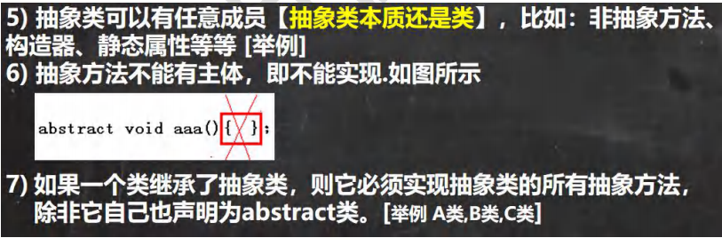


# 七、接口

## （一）基本介绍


- 在接口中，可以省略abstract方法

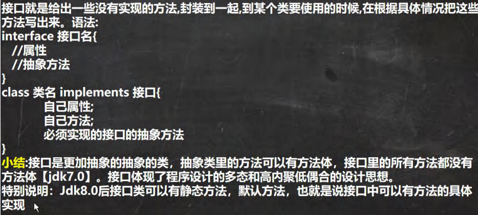

## （二）注意事项

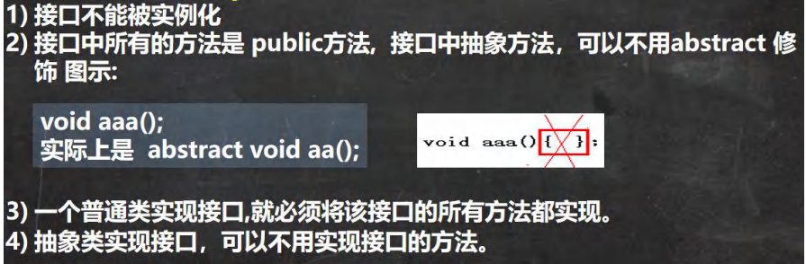

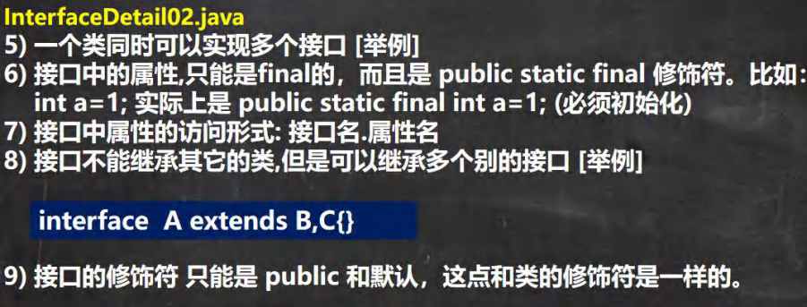

## （三）接口和继承类的区别

- “实现”这种机制是对Java单继承机制的一种补充
- 当子类继承了父类，就自动的拥有父类的功能
- 如果子类需要扩展功能，可以通过实现接口的方式扩展. 
- 可以理解 实现接口 是 对 java 单继承机制的一种补充.

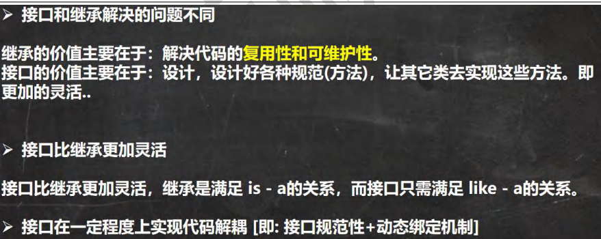

## （四）接口的多态特性

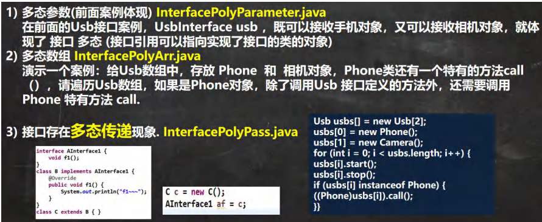

### 1、多态数组

```java
public class InterfacePolyParameter {
public static void main(String[] args) {
//接口的多态体现
//接口类型的变量 if01 可以指向 实现了 IF 接口类的对象实例
IF if01 = new Monster();
if01 = new Car();
//继承体现的多态
//父类类型的变量 a 可以指向 继承 AAA 的子类的对象实例
AAA a = new BBB();
a = new CCC();
}
}
interface IF {}
class Monster implements IF{}
class Car implements IF{}
class AAA {
}
class BBB extends AAA {}
class CCC extends AAA {}
package com.hspedu.interface_;
public class InterfacePolyArr {
public static void main(String[] args) {
//多态数组 -> 接口类型数组
Usb[] usbs = new Usb[2];
usbs[0] = new Phone_();
usbs[1] = new Camera_();
/*
给 Usb 数组中，存放 Phone 和 相机对象，Phone 类还有一个特有的方法 call（），
请遍历 Usb 数组，如果是 Phone 对象，除了调用 Usb 接口定义的方法外，
还需要调用 Phone 特有方法 call
*/
for(int i = 0; i < usbs.length; i++) {
usbs[i].work();//动态绑定.. //和前面一样，我们仍然需要进行类型的向下转型
if(usbs[i] instanceof Phone_) {//判断他的运行类型是 Phone_
((Phone_) usbs[i]).call();
}
}
}
}
interface Usb{
void work();
}
class Phone_ implements Usb {
public void call() {
System.out.println("手机可以打电话...");
}
@Override
public void work() {
System.out.println("手机工作中...");
}
}
class Camera_ implements Usb {
@Override

public void work() {
System.out.println("相机工作中...");
}
}
```

### 2、多态传递

```java
/**
* 演示多态传递现象
*/
public class InterfacePolyPass {
public static void main(String[] args) {
//接口类型的变量可以指向，实现了该接口的类的对象实例
IG ig = new Teacher();
//如果 IG 继承了 IH 接口，而 Teacher 类实现了 IG 接口
//那么，实际上就相当于 Teacher 类也实现了 IH 接口. 
//这就是所谓的 接口多态传递现象. 
    IH ih = new Teacher();
    
}
interface IH {
void hi();
}
interface IG extends IH{ }
class Teacher implements IG 
@Override
public void hi() {
  
}

```

# 八、内部类

## （一）基本介绍

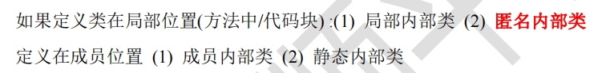

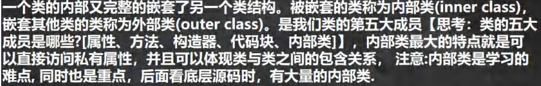

### 1、语法

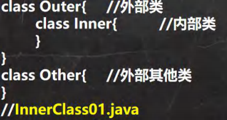

## （二）内部类的分类

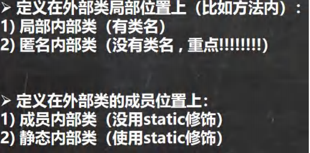

### 1、局部内部类的使用

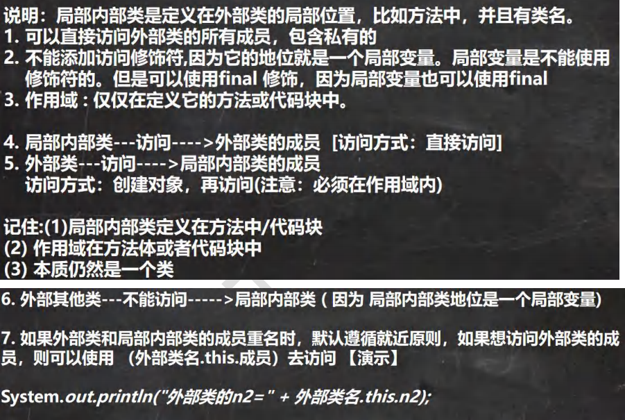

### 2、匿名内部类的使用

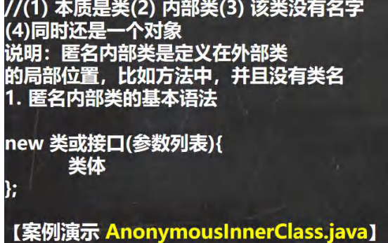


```java
/**
* 演示匿名内部类的使用
*/
public class AnonymousInnerClass {
public static void main(String[] args) {
Outer04 outer04 = new Outer04();
outer04.method();
}
}
class Outer04 { //外部类
private int n1 = 10;//属性
public void method() {//方法
//基于接口的匿名内部类
//老韩解读
//1.需求： 想使用 IA 接口,并创建对象
//2.传统方式，是写一个类，实现该接口，并创建对象
//3.老韩需求是 Tiger/Dog 类只是使用一次，后面再不使用
//4. 可以使用匿名内部类来简化开发
//5. tiger 的编译类型 ? IA
//6. tiger 的运行类型 ? 就是匿名内部类 Outer04$1
/*
我们看底层 会分配 类名 Outer04$1
class Outer04$1 implements IA {
@Override
public void cry() {
System.out.println("老虎叫唤...");
}
}
*/
//7. jdk 底层在创建匿名内部类 Outer04$1,立即马上就创建了 Outer04$1 实例，并且把地址
// 返回给 tiger
//8. 匿名内部类使用一次，就不能再使用
IA tiger = new IA() {
@Override
public void cry() {
System.out.println("老虎叫唤...");
}
};
System.out.println("tiger 的运行类型=" + tiger.getClass());
tiger.cry();
tiger.cry();
tiger.cry();
// IA tiger = new Tiger();
// tiger.cry();
//演示基于类的匿名内部类
//分析
//1. father 编译类型 Father
//2. father 运行类型 Outer04$2
//3. 底层会创建匿名内部类
/*
class Outer04$2 extends Father{
@Override
public void test() {
System.out.println("匿名内部类重写了 test 方法");
}
}
*/
//4. 同时也直接返回了 匿名内部类 Outer04$2 的对象
//5. 注意("jack") 参数列表会传递给 构造器
Father father = new Father("jack"){
@Override
public void test() {
System.out.println("匿名内部类重写了 test 方法");
}
};
System.out.println("father 对象的运行类型=" + father.getClass());//Outer04$2
father.test();
//基于抽象类的匿名内部类
Animal animal = new Animal(){
@Override
void eat() {
System.out.println("小狗吃骨头...");
}
};
animal.eat();
}
}
interface IA {//接口
public void cry();
}
//class Tiger implements IA {
//
// @Override
// public void cry() {
// System.out.println("老虎叫唤...");
// }
//}
//class Dog implements IA{
// @Override
// public void cry() {
// System.out.println("小狗汪汪...");
// }
//}
class Father {//类
public Father(String name) {//构造器
System.out.println("接收到 name=" + name);
}
public void test() {//方法
}
}
abstract class Animal { //抽象类
abstract void eat();
}
```


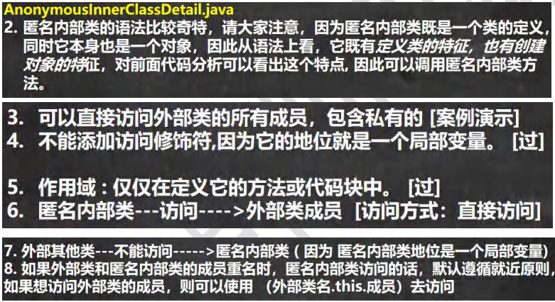       

```java
import com.hspedu.abstract_.AA;
public class InnerClassExercise01 {
public static void main(String[] args) {
//当做实参直接传递，简洁高效
f1(new IL() {
@Override
public void show() {
System.out.println("这是一副名画~~...");
}
});
//传统方法
f1(new Picture());
}
//静态方法,形参是接口类型
public static void f1(IL il) {
il.show();
}
}
//接口
interface IL {
void show();
}
//类->实现 IL => 编程领域 (硬编码)
class Picture implements IL {
@Override
public void show() {
System.out.println("这是一副名画 XX...");
}
}
```

### 3、成员内部类

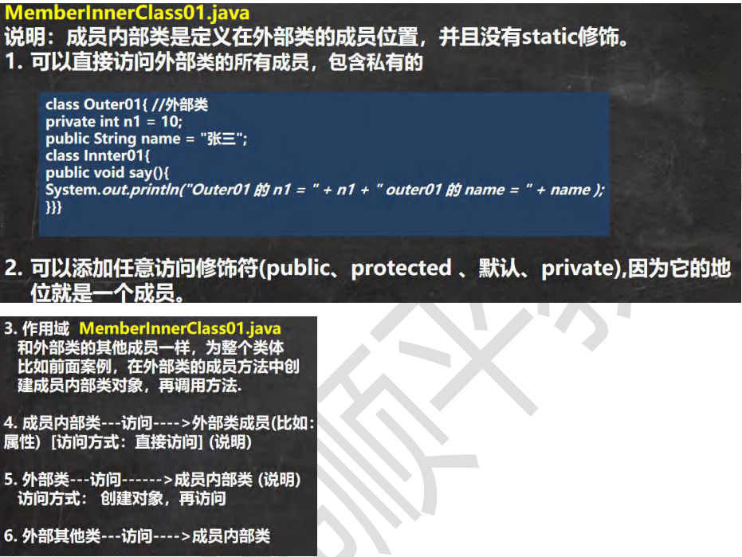

### 4、静态内部类的使用

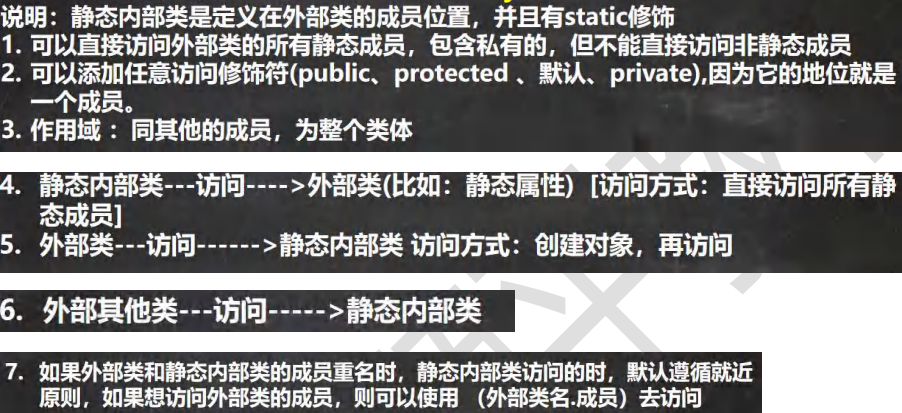


